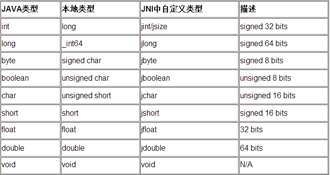
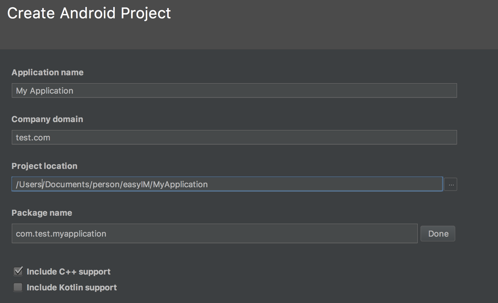

JNI是Android中比较重要的一块知识，Java层与C/C++层进行调用的桥梁。所以今天就来学习一下JNI相关的知识。

## JNI（Java Native Interface）

JNI(Java Native Interface):java本地开发接口,JNI是一个协议，这个协议用来沟通java代码和外部的本地代码(c/c++),外部的c/c++代码也可以调用java代码。

####为什么使用JNI？

1. 效率上 C/C++是本地语言，比java更高效
2. 代码移植，如果之前用C语言开发过模块，可以复用已经存在的c代码
3. java反编译比C语言容易，一般加密算法都是用C语言编写，不容易被反编译

#### Java基本数据类型与C语言基本数据类型的对应


#### 引用类型对应


## JNI例子

在AS3.0之后，AS对JNI的工程构建做了一些改动，可以非常方便地创建一个支持JNI的工程。



只要在创建工程的时候选择包括C++，其他都是正常的创建流程。

最终创建出的工程结构如下图：


默认生成一个`stringFromJNI`的方法，返回值为String类型。

生成的对应C代码为：

```
#include <jni.h>
#include <string>

extern "C" JNIEXPORT jstring

JNICALL
Java_com_liuwei_ndktest_MainActivity_stringFromJNI(
        JNIEnv *env,
        jobject /* this */) {
    std::string hello = "Hello from C++";
    return env->NewStringUTF(hello.c_str());
}
```

AS帮我们创建一个CPP文件夹用来保存我们的C／C++文件，CMakeList文件也帮我们创建成功，可以直接运行，极大方便了我们Android开发程序员。

> C/C++中生成方法的名称规范为：Java _ 包名 _ 类名 _ 方法名

### JNI传递一个数组

上面AS自动生成的示例代码展示了JNI对String的操作，然后我们看一下JNI传递一个数组。

#### Java代码

```
public native void change(int[] arr);
```

#### 生成C/C++代码

在AS3.0之后也不用我们去自己写对应的C/C++代码，AS可以帮我们自动生成。


生成的模版代码：

```
extern "C" JNIEXPORT void 

JNICALL
Java_com_liuwei_ndktest_MainActivity_change(JNIEnv *env, jobject instance, jintArray arr_) {
    jint *arr = env->GetIntArrayElements(arr_, NULL);

    // TODO

    env->ReleaseIntArrayElements(arr_, arr, 0);
}
```
自动生成的代码连获取数组数据以及释放数组内存都帮我们写好了，简直了～

然后我们做一些操作：

```
extern "C" JNIEXPORT void

JNICALL
Java_com_liuwei_ndktest_MainActivity_change(JNIEnv *env, jobject instance, jintArray arr_) {
    int length = env->GetArrayLength(arr_);
    jint *arr = env->GetIntArrayElements(arr_, NULL);


    //每个数据加10
    for (int i = 0; i < length; ++i) {
        *(arr + i) += 10;
    }

    env->ReleaseIntArrayElements(arr_, arr, 0);
}
```

在Java中调用该方法

```
 int[] a = {1, 2, 3, 4, 5, 6};

  change(a);

  for (int i = 0; i < a.length; i++) {
       Log.e("Test", "a" + i + "= " + a[i]);
   }
```

打印结果：

```
 E/Test: a0= 11
 E/Test: a1= 12
    a2= 13
    a3= 14
    a4= 15
    a5= 16
```

每个数据都加了10，OK。

可以看到我们在这个方法中没有返回值，直接打印相同的数组，但实际结果也发生了改变，这是因为：**传递数组其实是传递一个堆内存的数组首地址的引用过去，所以实际操作的是同一块内存，当调用完方法，不需要返回值,实际上参数内容已经改变，Android中很多操作硬件的方法都是这种C语言的传引用的思路。**

### 在C++中调用java方法

Java中：

```
public void sayJavaHi() {
        Log.e("Test", "Hi Java");
    }

    public native void say();
```

我们调用say方法，然后由C调用sayJavaHi方法。


C++方法：

```

#include <android/log.h>

#define LOG_TAG "System.out"
#define LOGD(...) __android_log_print(ANDROID_LOG_DEBUG, LOG_TAG, __VA_ARGS__)

extern "C" JNIEXPORT void 
JNICALL
Java_com_liuwei_ndktest_MainActivity_say(JNIEnv *env, jobject instance) {
    LOGD("debug日志");

    jclass jclass1 = env->FindClass("com/liuwei/ndktest/MainActivity");

    jmethodID methodID = env->GetMethodID(jclass1, "sayJavaHi", "()V");
    env->CallVoidMethod(instance, methodID);
}
```

在C++方法中我们使用反射调用Java层的代码。

最终结果：

```
08-17 20:30:05.637 8791-8791/com.liuwei.ndktest D/System.out: debug日志
08-17 20:30:05.637 8791-8791/com.liuwei.ndktest E/Test: Hi Java
```

## 补充
这里说一下GetMethodID方法，第一个参数：Java类对象；第二个参数：参数名（或方法名）；第三个参数：该参数（或方法）的签名。

比较麻烦的是第三个参数，JNI是以"(*)+"形式表示函数的有哪些传入参数，传入参数的类型，返回值的类型。"()" 中的字符表示传入参数，后面的则代表返回值。

例如：

 "()V" 就表示void Func();

 "(II)V" 表示 void Func(int, int);

 "(Ljava/lang/String;Ljava/lang/String;)I".表示 int Func(String,String)


另外数组类型的简写,则用"["加上如表A所示的对应类型的简写形式进行表示就可以了，
比如：**[I** 表示 int [];**[L/java/lang/objects;**表示Objects[],另外。引用类型（除基本类型的数组外）的标示最后都有个";"

## 补充二
对于这个方法参数中的JNIEnv* env参数的解释:

JNIEnv类型实际上代表了Java环境，通过这个JNIEnv* 指针，就可以对Java端的代码进行操作。例如，创建Java对象，调用Java对象的方法，获取Java对象中的属性等等。JNIEnv的指针会被JNI传入到本地方法的实现函数中来对Java端的代码进行操作。

JNIEnv类中有很多函数可以用：

NewObject:创建Java类中的对象

NewString:创建Java类中的String对象

New<Type>Array:创建类型为Type的数组对象

Get<Type>Field:获取类型为Type的字段

Set<Type>Field:设置类型为Type的字段的值

GetStatic<Type>Field:获取类型为Type的static的字段

SetStatic<Type>Field:设置类型为Type的static的字段的值

Call<Type>Method:调用返回类型为Type的方法

CallStatic<Type>Method:调用返回值类型为Type的static方法

等许多的函数。