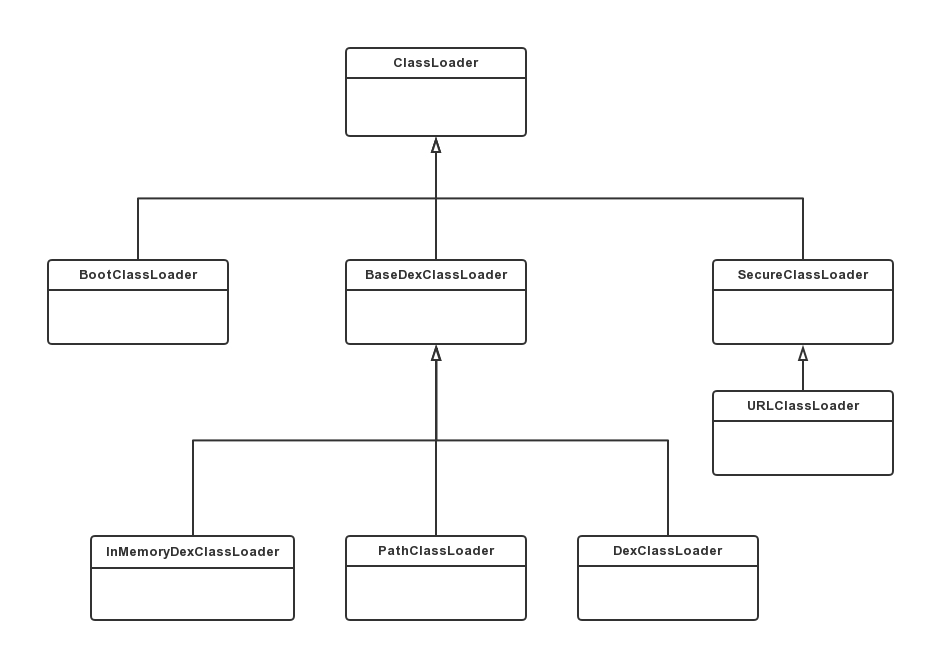
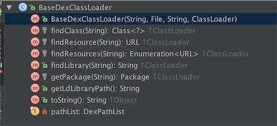

我们知道Java中的ClassLoader可以加载jar文件和Class文件（本质是加载Class文件），这一点在Android中并不适用，因为无论是DVM还是ART它们加载的不再是Class文件，而是dex文件，这就需要重新设计ClassLoader相关类，我们先来学习ClassLoader的类型。 

## ClassLoader类型
Android中的ClassLoader类型和Java中的ClassLoader类型类似，也分为两种类型，分别是系统ClassLoader和自定义ClassLoader。其中系统ClassLoader包括三种分别是BootClassLoader、PathClassLoader和DexClassLoader。

### BootClassLoader

Android系统启动时会使用BootClassLoader来预加载常用类，与Java中的BootClassLoader不同，它并不是由C/C++代码实现，而是由Java实现的，BootClassLoade的代码如下所示。 

```
class BootClassLoader extends ClassLoader {
    private static BootClassLoader instance;
    @FindBugsSuppressWarnings("DP_CREATE_CLASSLOADER_INSIDE_DO_PRIVILEGED")
    public static synchronized BootClassLoader getInstance() {
        if (instance == null) {
            instance = new BootClassLoader();
        }
        return instance;
    }
...
}
```

BootClassLoader是ClassLoader的内部类，并继承自ClassLoader。BootClassLoader是一个单例类，需要注意的是BootClassLoader的访问修饰符是默认的，只有在同一个包中才可以访问，因此我们在应用程序中是无法直接调用的。

### PathClassLoader

Android系统使用PathClassLoader来加载系统类和应用程序的类，如果是加载非系统应用程序类，则会加载data/app/目录下的dex文件以及包含dex的apk文件或jar文件，不管是加载那种文件，最终都是要加载dex文件，在这里为了方便理解，我们将dex文件以及包含dex的apk文件或jar文件统称为dex相关文件。PathClassLoader不建议开发直接使用。来查看它的代码： 

```
public class PathClassLoader extends BaseDexClassLoader {
    public PathClassLoader(String dexPath, ClassLoader parent) {
        super(dexPath, null, null, parent);
    }
    public PathClassLoader(String dexPath, String librarySearchPath, ClassLoader parent) {
        super(dexPath, null, librarySearchPath, parent);
    }
}
```

PathClassLoader继承自BaseDexClassLoader，很明显PathClassLoader的方法实现都在BaseDexClassLoader中。从PathClassLoader的构造方法也可以看出它遵循了双亲委托模式。

PathClassLoader的构造方法有三个参数：

* dexPath：dex文件以及包含dex的apk文件或jar文件的路径集合，多个路径用文件分隔符分隔，默认文件分隔符为‘：’。
* librarySearchPath：包含 C/C++ 库的路径集合，多个路径用文件分隔符分隔分割，可以为null。
* parent：ClassLoader的parent。

### DexClassLoader

DexClassLoader可以加载dex文件以及包含dex的apk文件或jar文件，也支持从SD卡进行加载，这也就意味着DexClassLoader可以在应用未安装的情况下加载dex相关文件。因此，它是热修复和插件化技术的基础。来查看它的代码，如下所示。 

```
public class DexClassLoader extends BaseDexClassLoader {
    public DexClassLoader(String dexPath, String optimizedDirectory,
            String librarySearchPath, ClassLoader parent) {
        super(dexPath, new File(optimizedDirectory), librarySearchPath, parent);
        }
}
```

DexClassLoader构造方法的参数要比PathClassLoader多一个optimizedDirectory参数，参数optimizedDirectory代表什么呢？我们知道应用程序第一次被加载的时候，为了提高以后的启动速度和执行效率，Android系统会对dex相关文件做一定程度的优化，并生成一个ODEX文件，此后再运行这个应用程序的时候，只要加载优化过的ODEX文件就行了，省去了每次都要优化的时间，而参数optimizedDirectory就是代表存储ODEX文件的路径，这个路径必须是一个内部存储路径。 
PathClassLoader没有参数optimizedDirectory，这是因为PathClassLoader已经默认了参数optimizedDirectory的路径为：/data/dalvik-cache。DexClassLoader 也继承自BaseDexClassLoader ，方法实现也都在BaseDexClassLoader中。

## ClassLoader的继承关系


可以看到上面一共有8个ClassLoader相关类，其中有一些和Java中的ClassLoader相关类十分类似，下面简单对它们进行介绍：

* ClassLoader是一个抽象类，其中定义了ClassLoader的主要功能。BootClassLoader是它的内部类。
* SecureClassLoader类和JDK8中的SecureClassLoader类的代码是一样的，它继承了抽象类ClassLoader。SecureClassLoader并不是ClassLoader的实现类，而是拓展了ClassLoader类加入了权限方面的功能，加强了ClassLoader的安全性。
* URLClassLoader类和JDK8中的URLClassLoader类的代码是一样的，它继承自SecureClassLoader，用来通过URl路径从jar文件和文件夹中加载类和资源。
* InMemoryDexClassLoader是Android8.0新增的类加载器，继承自BaseDexClassLoader，用于加载内存中的dex文件。
* BaseDexClassLoader继承自ClassLoader，是抽象类ClassLoader的具体实现类，PathClassLoader和DexClassLoader都继承它。

## DexClassLoader

介绍 DexClassLoader 之前，先来看看其官方描述：

> A class loader that loads classes from .jar and .apk filescontaining a classes.dex entry. This can be used to execute code notinstalled as part of an application.

DexClassLoader 的源码里面只有一个构造方法，这里也是遵从双亲委托模型：

```
public DexClassLoader(String dexPath, String optimizedDirectory,
        String libraryPath, ClassLoader parent) {
    super(dexPath, new File(optimizedDirectory), libraryPath, parent);
}
```

参数说明：

1. String dexPath: 包含 class.dex 的 apk、jar 文件路径 ，多个用文件分隔符(默认是 ：)分隔

2. String optimizedDirectory : 用来缓存优化的 dex 文件的路径，即从 apk 或 jar 文件中提取出来的 dex 文件。该路径不可以为空，且应该是应用私有的，有读写权限的路径

3. String libraryPath: 存储 C/C++ 库文件的路径集

4. ClassLoader parent : 父类加载器，遵从双亲委托模型

PathClassLoader 和 DexClassLoader，但这两者都是对 BaseDexClassLoader 的一层简单封装，真正的实现都在 BaseClassLoader 内。因此简单分析一下BaseClassLoader。

## BaseClassLoader

先来看一眼 BaseClassLoader 的结构：



其中有个重要的字段 private final DexPathList pathList，其继承 ClassLoader 实现的 findClass()、findResource()
均是基于 pathList 来实现的（省略了部分源码）：

```
    @Override
    protected Class<?> findClass(String name) throws ClassNotFoundException {
        List<Throwable> suppressedExceptions = new ArrayList<Throwable>();
        Class c = pathList.findClass(name, suppressedExceptions);
        ...
        return c;
    }
    @Override
    protected URL findResource(String name) {
        return pathList.findResource(name);
    }
    @Override
    protected Enumeration<URL> findResources(String name) {
        return pathList.findResources(name);
    }
    @Override
    public String findLibrary(String name) {
        return pathList.findLibrary(name);
    }
```

那么重要的部分则是在 DexPathList 类的内部了，DexPathList 的构造方法也较为简单，和之前介绍的类似：

```
public DexPathList(ClassLoader definingContext, String dexPath,
        String libraryPath, File optimizedDirectory) {
    ...
}
```

接受之前传进来的包含 dex 的 apk/jar/dex 的路径集、native 库的路径集和缓存优化的 dex 文件的路径，然后调用 makePathElements()方法生成一个Element[] dexElements数组，Element 是 DexPathList 的一个嵌套类，其有以下字段：

```
static class Element {
    private final File dir;
    private final boolean isDirectory;
    private final File zip;
    private final DexFile dexFile;
    private ZipFile zipFile;
    private boolean initialized;
}
```

makePathElements() 是如何生成 Element 数组的？继续看源码：

```
private static Element[] makePathElements(List<File> files, File optimizedDirectory,
                                          List<IOException> suppressedExceptions) {
    List<Element> elements = new ArrayList<>();
    // 遍历所有的包含 dex 的文件
    for (File file : files) {
        File zip = null;
        File dir = new File("");
        DexFile dex = null;
        String path = file.getPath();
        String name = file.getName();
        // 判断是不是 zip 类型
        if (path.contains(zipSeparator)) {
            String split[] = path.split(zipSeparator, 2);
            zip = new File(split[0]);
            dir = new File(split[1]);
        } else if (file.isDirectory()) {
            // 如果是文件夹,则直接添加 Element,这个一般是用来处理 native 库和资源文件
            elements.add(new Element(file, true, null, null));
        } else if (file.isFile()) {
            // 直接是 .dex 文件,而不是 zip/jar 文件(apk 归为 zip),则直接加载 dex 文件
            if (name.endsWith(DEX_SUFFIX)) {
                try {
                    dex = loadDexFile(file, optimizedDirectory);
                } catch (IOException ex) {
                    System.logE("Unable to load dex file: " + file, ex);
                }
            } else {
                // 如果是 zip/jar 文件(apk 归为 zip),则将 file 值赋给 zip 字段,再加载 dex 文件
                zip = file;
                try {
                    dex = loadDexFile(file, optimizedDirectory);
                } catch (IOException suppressed) {
                    suppressedExceptions.add(suppressed);
                }
            }
        } else {
            System.logW("ClassLoader referenced unknown path: " + file);
        }
        if ((zip != null) || (dex != null)) {
            elements.add(new Element(dir, false, zip, dex));
        }
    }
    // list 转为数组
    return elements.toArray(new Element[elements.size()]);

```

oadDexFile()方法最终会调用 JNI 层的方法来读取 dex 文件，这里不再深入探究。
接下来看以下 DexPathList 的 findClass()方法，其根据传入的完整的类名来加载对应的 class，源码如下：

```
public Class findClass(String name, List<Throwable> suppressed) {
    // 遍历 dexElements 数组，依次寻找对应的 class，一旦找到就终止遍历
    for (Element element : dexElements) {
        DexFile dex = element.dexFile;
        if (dex != null) {
            Class clazz = dex.loadClassBinaryName(name, definingContext, suppressed);
            if (clazz != null) {
                return clazz;
            }
        }
    }
    // 抛出异常
    if (dexElementsSuppressedExceptions != null) {
        suppressed.addAll(Arrays.asList(dexElementsSuppressedExceptions));
    }
    return null;
}
```

这里有关于热修复实现的一个点，就是将补丁 dex 文件放到 dexElements 数组前面，这样在加载 class 时，优先找到补丁包中的 dex 文件，加载到 class 之后就不再寻找，从而原来的 apk 文件中同名的类就不会再使用，从而达到修复的目的。

至此，BaseDexClassLader 寻找 class 的路线就清晰了：

1. 当传入一个完整的类名，调用 BaseDexClassLader 的 findClass(String name) 方法
2. BaseDexClassLader 的 findClass 方法会交给 DexPathList 的 findClass(String name, List<Throwable> suppressed)方法处理
3. 在 DexPathList 方法的内部，会遍历 dexFile ，通过 DexFile的dex.loadClassBinaryName(name,definingContext, suppressed)来完成类的加载

需要注意到的是，在项目中使用 BaseDexClassLoader 或者 DexClassLoader 去加载某个 dex 或者 apk 中的 class 时，是无法调用 findClass()方法的，因为该方法是包访问权限，你需要调用 loadClass(String className)
，该方法其实是 BaseDexClassLoader 的父类 ClassLoader 内实现的：

```
public Class<?> loadClass(String className) throws ClassNotFoundException {
    return loadClass(className, false);
}

protected Class<?> loadClass(String className, boolean resolve) throws ClassNotFoundException {
    Class<?> clazz = findLoadedClass(className);
    if (clazz == null) {
        ClassNotFoundException suppressed = null;
        try {
            clazz = parent.loadClass(className, false);
        } catch (ClassNotFoundException e) {
            suppressed = e;
        }
        if (clazz == null) {
            try {
                clazz = findClass(className);
            } catch (ClassNotFoundException e) {
                e.addSuppressed(suppressed);
                throw e;
            }
        }
    }
    return clazz;
}
```

上面这段代码结合之前提到的双亲委托模型就很好理解了，先查找当前的 ClassLoader 是否已经加载过，如果没有就交给父 ClassLoader 去加载，如果父 ClassLoader 没有找到，才调用当前 ClassLoader 来加载，此时就是调用上面分析的 findClass() 方法了。

出自：

[小小亭长博客](https://www.jianshu.com/p/96a72d1a7974) 

[刘望舒博客](https://blog.csdn.net/itachi85)