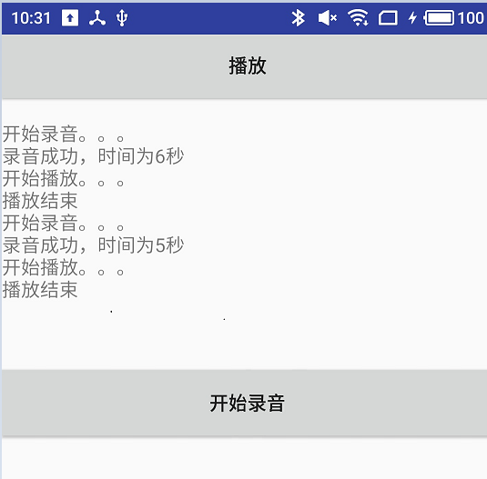

[Android音视频(一) Camera2 API采集数据](https://david1840.github.io/2019/01/04/Android%E9%9F%B3%E8%A7%86%E9%A2%91-%E4%B8%80-Camera2-API%E9%87%87%E9%9B%86%E6%95%B0%E6%8D%AE/)

[Android音视频(二)音频AudioRecord和AudioTrack](https://david1840.github.io/2019/01/06/Android%E9%9F%B3%E8%A7%86%E9%A2%91-%E4%BA%8C-%E9%9F%B3%E9%A2%91AudioRecord%E5%92%8CAudioTrack/)

[Android音视频(三)FFmpeg Camera2推流直播]()

MediaCodec类可以访问底层媒体编解码框架（StageFright 或 OpenMAX），即编解码组件，它是Android基本的多媒体支持基础架构的一部分，通常和MediaExtractor、MediaSync、MediaMuxer、MediaCrypto、MediaDrm、Image、Surface和AudioTrack一起使用。它本身并不是Codec，它通过调用底层编解码组件获得了Codec的能力。

## MediaCodec的工作方式

MediaCodec处理输入数据产生输出数据。当异步处理数据时，使用一组输入和输出Buffer队列。通常，在逻辑上，客户端请求（或接收）数据后填入预先设定的空输入缓冲区，输入Buffer填满后将其传递到MediaCodec并进行编解码处理。之后MediaCodec编解码后的数据填充到一个输出Buffer中。最后，客户端请求（或接收）输出Buffer，消耗输出Buffer中的内容，用完后释放，给回MediaCodec重新填充输出数据。


必须保证输入和输出队列同时非空，即至少有一个输入Buffer和输出Buffer才能工作。

## MediaCodec状态周期图

在MediaCodec的生命周期中存在三种状态 ：Stopped、Executing、Released。

Stopped状态实际上还可以处在三种状态：Uninitialized、Configured、Error。

Executing状态也分为三种子状态：Flushed, Running、End-of-Stream。


从上图可以看出：

1. 当创建编解码器的时候处于未初始化状态。首先你需要调用configure(…)方法让它处于Configured状态，然后调用start()方法让其处于Executing状态。在Executing状态下，你就可以使用上面提到的缓冲区来处理数据。

2. Executing的状态下也分为三种子状态：Flushed, Running、End-of-Stream。在start() 调用后，编解码器处于Flushed状态，这个状态下它保存着所有的缓冲区。一旦第一个输入buffer出现了，编解码器就会自动运行到Running的状态。当带有end-of-stream标志的buffer进去后，编解码器会进入End-of-Stream状态，这种状态下编解码器不在接受输入buffer，但是仍然在产生输出的buffer。此时你可以调用flush()方法，将编解码器重置于Flushed状态。

3. 调用stop()将编解码器返回到未初始化状态，然后可以重新配置。 完成使用编解码器后，您必须通过调用release()来释放它。
4. 在极少数情况下，编解码器可能会遇到错误并转到错误状态。 这是使用来自排队操作的无效返回值或有时通过异常来传达的。 调用reset()使编解码器再次可用。 您可以从任何状态调用它来将编解码器移回未初始化状态。 否则，调用 release()动到终端释放状态。

## MediaCodec的优缺点

优点：**功耗低，速度快**

缺点：**扩展性不强，不同芯片厂商提供的支持方案不同，导致程序移植性差**

适用场景：适合有固定的硬件方案的项目，如智能家居类；需要长时间摄像。


## MediaCodec 编解码实现

做了一个Demo，使用AudioRecord录音，使用MediaCodec 编码为AAC并保存文件，然后可以从AAC解码为PCM数据，再用AudioTrack播放。



### 1、编码PCM数据，保存为AAC文件

```
/**
 * 初始化编码器
 */
private void initAudioEncoder() {
    try {
        mAudioEncoder = MediaCodec.createEncoderByType(MediaFormat.MIMETYPE_AUDIO_AAC);
        MediaFormat format = MediaFormat.createAudioFormat(MediaFormat.MIMETYPE_AUDIO_AAC, 44100, 1);
        format.setInteger(MediaFormat.KEY_BIT_RATE, 96000);//比特率
        format.setInteger(MediaFormat.KEY_MAX_INPUT_SIZE, MAX_BUFFER_SIZE);
        mAudioEncoder.configure(format, null, null, MediaCodec.CONFIGURE_FLAG_ENCODE);
    } catch (IOException e) {
        e.printStackTrace();
    }

    if (mAudioEncoder == null) {
        Log.e(TAG, "create mediaEncode failed");
        return;
    }

    mAudioEncoder.start(); // 启动MediaCodec,等待传入数据
    encodeInputBuffers = mAudioEncoder.getInputBuffers(); //上面介绍的输入和输出Buffer队列
    encodeOutputBuffers = mAudioEncoder.getOutputBuffers();
    mAudioEncodeBufferInfo = new MediaCodec.BufferInfo();
}
```

### 2、解码AAC AudioTrack播放

[Github源码](https://github.com/David1840/AudioDemo/blob/master/app/src/main/java/com/liuwei/audiodemo/MediaCodecActivity.java)


