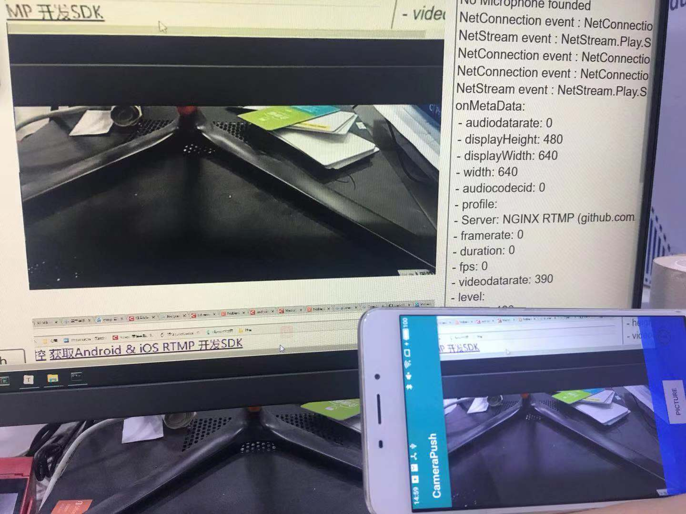

[Android音视频(一) Camera2 API采集数据](https://david1840.github.io/2019/01/04/Android%E9%9F%B3%E8%A7%86%E9%A2%91-%E4%B8%80-Camera2-API%E9%87%87%E9%9B%86%E6%95%B0%E6%8D%AE/)

[Android音视频(二)音频AudioRecord和AudioTrack](https://david1840.github.io/2019/01/06/Android%E9%9F%B3%E8%A7%86%E9%A2%91-%E4%BA%8C-%E9%9F%B3%E9%A2%91AudioRecord%E5%92%8CAudioTrack/)

自己花了点时间实现了一个使用FFmpeg将Camera2视频数据推送到RTMP服务的简单Demo，在这里分享下，里面用到知识很多都是之前博客中用到的，难度不大。

## 1、 定义方法

定义了三个JNI方法

```java
public class FFmpegHandler {
    private FFmpegHandler() {
    }

    private static class SingletonInstance {
        private static final FFmpegHandler INSTANCE = new FFmpegHandler();
    }

    public static FFmpegHandler getInstance() {
        return SingletonInstance.INSTANCE;
    }


    static {
        System.loadLibrary("ffmpeg-handler");
    }

    //初始化参数
    public native int init(String outUrl);

    //推流，将Y、U、V数据分开传递
    public native int pushCameraData(byte[] buffer,int ylen,byte[] ubuffer,int ulen,byte[] vbuffer,int vlen);

    //结束
    public native int close();
}
```

## 2、Camera2实时数据

具体使用可查看[Android音视频(一) Camera2 API采集数据](https://david1840.github.io/2019/01/04/Android%E9%9F%B3%E8%A7%86%E9%A2%91-%E4%B8%80-Camera2-API%E9%87%87%E9%9B%86%E6%95%B0%E6%8D%AE/)

将ImageReader作为预览请求的Target之一，这样我们就可以将预览的数据拿到在onImageAvailable中进行处理推送。

```java
mImageReader = ImageReader.newInstance(640, 480,ImageFormat.YUV_420_888, 1); 
mImageReader.setOnImageAvailableListener(mOnImageAvailableListener, mBackgroundHandler);
```

```java
Surface imageSurface = mImageReader.getSurface();

mPreviewRequestBuilder = mCameraDevice.createCaptureRequest(CameraDevice.TEMPLATE_PREVIEW);

mPreviewRequestBuilder.addTarget(surface);
mPreviewRequestBuilder.addTarget(imageSurface);
```


将获取的Image数据解析为YUV数据，Y、U、V数据分别存储。具体请看[YUV数据格式与YUV_420_888](https://david1840.github.io/2018/12/20/YUV%E6%95%B0%E6%8D%AE%E6%A0%BC%E5%BC%8F%E4%B8%8EYUV_420_888/)。

目前这块暂时这样写着，网上的博客都比较旧了，有点不太合适，我想应该还会有更好的方法，后面再做优化。（或者这块你有什么好的处理方法，欢迎留言）。

```java
private final ImageReader.OnImageAvailableListener mOnImageAvailableListener
            = new ImageReader.OnImageAvailableListener() {

        @Override
        public void onImageAvailable(ImageReader reader) {
        
            Image image = reader.acquireLatestImage();

            if (image == null) {
                return;
            }

            final Image.Plane[] planes = image.getPlanes();

            int width = image.getWidth();
            int height = image.getHeight();
            
            // Y、U、V数据
            byte[] yBytes = new byte[width * height];
            byte uBytes[] = new byte[width * height / 4];
            byte vBytes[] = new byte[width * height / 4];
            
            //目标数组的装填到的位置
            int dstIndex = 0;
            int uIndex = 0;
            int vIndex = 0;

            int pixelsStride, rowStride;
            for (int i = 0; i < planes.length; i++) {
                pixelsStride = planes[i].getPixelStride();
                rowStride = planes[i].getRowStride();

                ByteBuffer buffer = planes[i].getBuffer();

                //如果pixelsStride==2，一般的Y的buffer长度=640*480，UV的长度=640*480/2-1
                //源数据的索引，y的数据是byte中连续的，u的数据是v向左移以为生成的，两者都是偶数位为有效数据
                byte[] bytes = new byte[buffer.capacity()];
                buffer.get(bytes);

                int srcIndex = 0;
                if (i == 0) {
                    //直接取出来所有Y的有效区域，也可以存储成一个临时的bytes，到下一步再copy
                    for (int j = 0; j < height; j++) {
                        System.arraycopy(bytes, srcIndex, yBytes, dstIndex, width);
                        srcIndex += rowStride;
                        dstIndex += width;
                    }
                } else if (i == 1) {
                    //根据pixelsStride取相应的数据
                    for (int j = 0; j < height / 2; j++) {
                        for (int k = 0; k < width / 2; k++) {
                            uBytes[uIndex++] = bytes[srcIndex];
                            srcIndex += pixelsStride;
                        }
                        if (pixelsStride == 2) {
                            srcIndex += rowStride - width;
                        } else if (pixelsStride == 1) {
                            srcIndex += rowStride - width / 2;
                        }
                    }
                } else if (i == 2) {
                    //根据pixelsStride取相应的数据
                    for (int j = 0; j < height / 2; j++) {
                        for (int k = 0; k < width / 2; k++) {
                            vBytes[vIndex++] = bytes[srcIndex];
                            srcIndex += pixelsStride;
                        }
                        if (pixelsStride == 2) {
                            srcIndex += rowStride - width;
                        } else if (pixelsStride == 1) {
                            srcIndex += rowStride - width / 2;
                        }
                    }
                }
            }
            // 将YUV数据交给C层去处理。
            FFmpegHandler.getInstance().pushCameraData(yBytes, yBytes.length, uBytes, uBytes.length, vBytes, vBytes.length);
            image.close();
        }

    };
```


## 3、初始化FFmpeg

直播推送的过程整体就是一个先将视频数据编码，再将编码后的数据写入数据流中推送给服务器的过程。

下面初始化的过程就是准备好数据编码器和一条已经连上服务器的数据流

```c
JNIEXPORT jint JNICALL Java_com_david_camerapush_ffmpeg_FFmpegHandler_init
        (JNIEnv *jniEnv, jobject instance, jstring url) {

    const char *out_url = (*jniEnv)->GetStringUTFChars(jniEnv, url, 0);

    //计算yuv数据的长度
    yuv_width = width;
    yuv_height = height;
    y_length = width * height;
    uv_length = width * height / 4;
    
    //output initialize
    int ret = avformat_alloc_output_context2(&ofmt_ctx, NULL, "flv", out_url);
    if (ret < 0) {
        LOGE("avformat_alloc_output_context2 error");
    }

    //初始化H264编码器
    pCodec = avcodec_find_encoder(AV_CODEC_ID_H264);
    if (!pCodec) {
        LOGE("Can not find encoder!\n");
        return -1;
    }

    pCodecCtx = avcodec_alloc_context3(pCodec);
    //编码器的ID号，这里为264编码器
    pCodecCtx->codec_id = pCodec->id;

    //像素的格式，也就是说采用什么样的色彩空间来表明一个像素点，这里使用YUV420P
    pCodecCtx->pix_fmt = AV_PIX_FMT_YUV420P;
    //编码器编码的数据类型
    pCodecCtx->codec_type = AVMEDIA_TYPE_VIDEO;
    //编码目标的视频帧大小，以像素为单位
    pCodecCtx->width = width;
    pCodecCtx->height = height;
    //帧频
    pCodecCtx->framerate = (AVRational) {15, 1};
    //时间基
    pCodecCtx->time_base = (AVRational) {1, 15};
    //目标的码率，即采样的码率；显然，采样码率越大，视频大小越大
    pCodecCtx->bit_rate = 400000;
    pCodecCtx->gop_size = 50;
    /* Some formats want stream headers to be separate. */
    if (ofmt_ctx->oformat->flags & AVFMT_GLOBALHEADER)
        pCodecCtx->flags |= AV_CODEC_FLAG_GLOBAL_HEADER;

    //H264 codec param
    pCodecCtx->qcompress = 0.6;
    //最大和最小量化系数
    pCodecCtx->qmin = 10;
    pCodecCtx->qmax = 51;
    //Optional Param
    //两个非B帧之间允许出现多少个B帧数
    //设置0表示不使用B帧，b 帧越多，图片越小
    pCodecCtx->max_b_frames = 0;
    AVDictionary *param = 0;
    //H.264
    if (pCodecCtx->codec_id == AV_CODEC_ID_H264) {
        av_dict_set(&param, "preset", "superfast", 0); //x264编码速度的选项
        av_dict_set(&param, "tune", "zerolatency", 0);
    }

    // 打开编码器
    if (avcodec_open2(pCodecCtx, pCodec, &param) < 0) {
        LOGE("Failed to open encoder!\n");
        return -1;
    }

    // 新建传输流，即将要直播的视频流
    video_st = avformat_new_stream(ofmt_ctx, pCodec);
    if (video_st == NULL) {
        return -1;
    }
    video_st->time_base = (AVRational) {25, 1};
    video_st->codecpar->codec_tag = 0;
    avcodec_parameters_from_context(video_st->codecpar, pCodecCtx);
    
    // 打开数据流，表示与rtmp服务器连接
    int err = avio_open(&ofmt_ctx->pb, out_url, AVIO_FLAG_READ_WRITE);
    if (err < 0) {
        LOGE("Failed to open output：%s", av_err2str(err));
        return -1;
    }

    //Write File Header
    avformat_write_header(ofmt_ctx, NULL);
    av_init_packet(&enc_pkt);

    return 0;
}
```

## 4、开始传输

对YUV数据编码，并将编码后数据写入准备好的直播流中。

```c
JNIEXPORT jint JNICALL Java_com_david_camerapush_ffmpeg_FFmpegHandler_pushCameraData
        (JNIEnv *jniEnv, jobject instance, jbyteArray yArray, jint yLen, jbyteArray uArray, jint uLen, jbyteArray vArray, jint vLen) {
    jbyte *yin = (*jniEnv)->GetByteArrayElements(jniEnv, yArray, NULL);
    jbyte *uin = (*jniEnv)->GetByteArrayElements(jniEnv, uArray, NULL);
    jbyte *vin = (*jniEnv)->GetByteArrayElements(jniEnv, vArray, NULL);

    int ret = 0;

     // 初始化Frame
    pFrameYUV = av_frame_alloc();
    // 通过指定像素格式、图像宽、图像高来计算所需的内存大小
    int picture_size = av_image_get_buffer_size(pCodecCtx->pix_fmt, pCodecCtx->width,pCodecCtx->height, 1);
    //分配指定大小的内存空间
    uint8_t *buffers = (uint8_t *) av_malloc(picture_size);
    //此函数类似于格式化已经申请的内存，即通过av_malloc()函数申请的内存空间。
    av_image_fill_arrays(pFrameYUV->data, pFrameYUV->linesize, buffers, pCodecCtx->pix_fmt,pCodecCtx->width, pCodecCtx->height, 1);

    // Frame中数据填充
    memcpy(pFrameYUV->data[0], yin, (size_t) yLen); //Y
    memcpy(pFrameYUV->data[1], uin, (size_t) uLen); //U
    memcpy(pFrameYUV->data[2], vin, (size_t) vLen); //V
    pFrameYUV->pts = count;
    pFrameYUV->format = AV_PIX_FMT_YUV420P;
    pFrameYUV->width = yuv_width;
    pFrameYUV->height = yuv_height;

    //初始化AVPacket
    enc_pkt.data = NULL;
    enc_pkt.size = 0;

    //开始编码YUV数据
    ret = avcodec_send_frame(pCodecCtx, pFrameYUV);
    if (ret != 0) {
        LOGE("avcodec_send_frame error");
        return -1;
    }
    //获取编码后的H264数据
    ret = avcodec_receive_packet(pCodecCtx, &enc_pkt);
    if (ret != 0 || enc_pkt.size <= 0) {
        LOGE("avcodec_receive_packet error %s", av_err2str(ret));
        return -2;
    }
    
    enc_pkt.stream_index = video_st->index;
    enc_pkt.pts = count * (video_st->time_base.den) / ((video_st->time_base.num) * fps);
    enc_pkt.dts = enc_pkt.pts;
    enc_pkt.duration = (video_st->time_base.den) / ((video_st->time_base.num) * fps);
    enc_pkt.pos = -1;

    // 往直播流写数据
    ret = av_interleaved_write_frame(ofmt_ctx, &enc_pkt);
    if (ret != 0) {
        LOGE("av_interleaved_write_frame failed");
    }
    count++;
    
    //释放内存，Java写多了经常会忘记这块**
    av_packet_unref(&enc_pkt);
    av_frame_free(&pFrameYUV);
    av_free(buffers);
    (*jniEnv)->ReleaseByteArrayElements(jniEnv, yArray, yin, 0);
    (*jniEnv)->ReleaseByteArrayElements(jniEnv, uArray, uin, 0);
    (*jniEnv)->ReleaseByteArrayElements(jniEnv, vArray, vin, 0);

    return 0;
}
```

## 效果



这是Demo运行后的结果，推送视频OK，但是可能会有2到3秒的延迟（可能也跟网速有关）。目前就做到这种程度，后面会优化延迟、音频直播、音视频同步等都会慢慢加上去。

[Github源码 — CameraPush](https://github.com/David1840/CameraPush)


**Tips:**

[Mac 下搭建RTMP直播](https://david1840.github.io/2018/11/23/FFmpeg%E5%AE%9E%E7%8E%B0%E7%AE%80%E5%8D%95%E7%9B%B4%E6%92%AD%E7%B3%BB%E7%BB%9F/)

图片中使用的在Windows下的[nginx-rtmp-win32](https://github.com/illuspas/nginx-rtmp-win32)，不需要编译，点击exe就可以运行。


