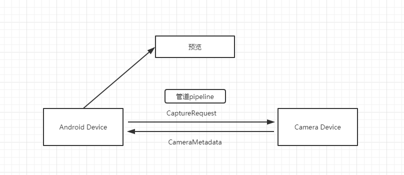

最近打算做一个Android上的摄像头直播Demo，第一步就是Android摄像头的预览和视频数据获取了。

## Camera2

在Android API21中Google发布了Camera2来取代原本的Camera，两者的变动也是比较大的。



Camera2中Google采用了pipeline（管道）的概念，将Camera Device相机设备和Android Device安卓设备连接起来， Android Device通过管道发送CaptureRequest请求给Camera Device，Camera Device通过管道返回CameraMetadata数据给Android Device，这一切建立在一个叫作CameraCaptureSession的会话中。


### Camera2主要类说明

在Camera2 架构在核心参与类角色有：CameraManager、CameraDevice、CameraCharacteristics、CameraRequest与CameraRequest.Builder、CameraCaptureSession以及CaptureResult。

#### CameraManager

位于android.hardware.camera2.CameraManager下，也是Android 21(5.0)添加的，和其他系统服务一样通过 `Context.getSystemService(Context.CAMERA_SERVICE)` 来完成初始化，主要用于管理系统摄像头。

- `manager.getCameraIdList()` 获取Android设备的摄像头列表
- `manager.getCameraCharacteristics(cameraId)` 获取指定摄像头的相关特性
- `manager.openCamera(String cameraId, CameraDevice.StateCallback callback, Handler handler)` 打开指定Id的摄像头

#### CameraDevice

CameraDevice是Camera2中抽象出来的一个对象，直接与系统硬件摄像头相联系。

- 通过CameraDevice.StateCallback监听摄像头的状态

  ```java
  private final CameraDevice.StateCallback mStateCallback = new CameraDevice.StateCallback(){
  
      @Override
      public void onOpened(@NonNull CameraDevice camera) {
          //摄像头打开，可以创建会话，开始预览
      }
  
      @Override
      public void onDisconnected(@NonNull CameraDevice camera) {
  
      }
  
      @Override
      public void onError(@NonNull CameraDevice camera, int error) {
  
      }
  };
  ```

-  管理CameraCaptureSession会话，相当于Android Device和Camera Device之间的管道，后面的数据交流都在这个会话中完成。
-  管理CaptureRequest，主要包括通过createCaptureRequest（int templateType）创建捕获请求，在需要预览、拍照、再次预览的时候都需要通过创建请求来完成。

#### CameraCaptureSession

正如前面所说，系统向摄像头发送 Capture 请求，而摄像头会返回 CameraMetadata，这一切都是在由对应的CameraDevice创建的CameraCaptureSession 会话完成，当程序需要预览、拍照、再次预览时，都需要先通过会话。CameraCaptureSession一旦被创建，直到对应的CameraDevice关闭才会死掉。虽然CameraCaptureSession会话用于从摄像头中捕获图像，但是只有同一个会话才能再次从同一摄像头中捕获图像。

- 管理CameraCaptureSession.StateCallback状态回调，用于接收有关CameraCaptureSession状态的更新的回调对象，主要回调方法有两个当CameraDevice 完成配置，对应的会话开始处理捕获请求时触发onConfigured(CameraCaptureSession session)方法，反之配置失败时候触发onConfigureFailed(CameraCaptureSession session)方法。
- 管理CameraCaptureSession.CaptureCallback捕获回调，用于接收捕获请求状态的回调，当请求触发捕获已启动时、捕获完成时、在捕获图像时发生错误的情况下都会触发该回调对应的方法。
- 通过调用方法capture(CaptureRequest request, CameraCaptureSession.CaptureCallback listener, Handler handler)提交捕获图像请求，即拍照。
- 通过调用方法setRepeatingRequest(CaptureRequest request, CameraCaptureSession.CaptureCallback listener, Handler handler)请求不断重复捕获图像，即实现预览。
- 通过方法调用stopRepeating()实现停止捕获图像，即停止预览。

#### CameraCharacteristics

描述Cameradevice属性的对象，可以使用CameraManager通过getCameraCharacteristics（String cameraId）进行查询。

#### CameraRequest与CameraRequest.Builder

CameraRequest代表了一次捕获请求

CameraRequest.Builder用于描述捕获图片的各种参数设置，包含捕获硬件（传感器，镜头，闪存），对焦模式、曝光模式，处理流水线，控制算法和输出缓冲区的配置，然后传递到对应的会话中进行设置。CameraRequest.Builder负责生成CameraRequest对象。

#### CaptureResult

CaptureRequest描述是从图像传感器捕获单个图像的结果的子集的对象。


## 代码

现在Google自己写的一个样例程序对Android Camera2的介绍比较简单易懂，推荐入门学习。

[android-Camera2Basic](https://github.com/googlesamples/android-Camera2Basic)

## 获取YUV数据

在旧版本Camera中想要获取原始数据只要调用startPreview即可。而在Camera2中取消了这样的接口，改用ImageReader。

```Java
private final ImageReader.OnImageAvailableListener mOnImageAvailableListener
        = new ImageReader.OnImageAvailableListener() {

    @Override
    public void onImageAvailable(ImageReader reader) {
            Image image = reader.acquireLatestImage();
            //我们可以将这帧数据转成字节数组，类似于Camera1的PreviewCallback回调的预览帧数据
            if (image == null) {
                return;
            }
            // 这个里面存储的就是图像的原始数据，可以根据需求做转换
            Image.Plane[] planes = image.getPlanes();

            for (int i = 0; i < planes.length; i++) {
                ByteBuffer iBuffer = planes[i].getBuffer();
                int iSize = iBuffer.remaining();
                Log.i(TAG, "pixelStride  " + planes[i].getPixelStride());
                Log.i(TAG, "rowStride   " + planes[i].getRowStride());
                Log.i(TAG, "width  " + image.getWidth());
                Log.i(TAG, "height  " + image.getHeight());
                Log.i(TAG, "Finished reading data from plane  " + i);
            }
            image.close();
    }
}；
```

在这里我们可以将image转换为想要的原始YUV数据，再做后续的直播操作。