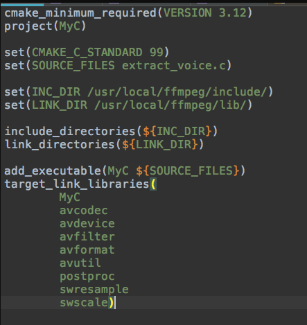

今天开始撸代码，首先使用FFmpeg的API抽取一个MP4文件的音频数据。

## IDE

应该是第一次在Mac上做C/C++开发，纠结过后选择使用CLion 开发。[CLion](https://www.jetbrains.com/clion/)是 JetBrains下专门用来开发C/C++的IDE，已经用习惯了Android studio和IntelliJ IDEA ，所以CLion用起来还是很顺手的。


在新建一个C项目后，需要把FFmpeg的库导入才能正常运行。我们修改项目的CMakeLists.txt文件。




## 抽取音频AAC数据

其实我们要做的主要就是一个文件的操作，把一个文件打开，从里面拿出它的一部分数据，再把这部分数据放到另一个文件中保存。

##### 定义参数

```C
#include <stdio.h>
#include <libavutil/log.h>
#include <libavformat/avformat.h>

//上下文
AVFormatContext *fmt_ctx = NULL;
AVFormatContext *ofmt_ctx = NULL;

//支持各种各样的输出文件格式，MP4，FLV，3GP等等
AVOutputFormat *output_fmt = NULL;

//输入流
AVStream *in_stream = NULL;

//输出流
AVStream *out_stream = NULL;

//存储压缩数据
AVPacket packet;

//要拷贝的流
int audio_stream_index = -1;
```


### 1.打开输入文件，提取参数

```C
//打开输入文件，关于输入文件的所有就保存到fmt_ctx中了
err_code = avformat_open_input(&fmt_ctx, src_fileName, NULL, NULL);

if (err_code < 0) {
    av_log(NULL, AV_LOG_ERROR, "cant open file:%s\n", av_err2str(err_code));
    return -1;
}

if(fmt_ctx->nb_streams<2){
      //流数小于2，说明这个文件音频、视频流这两条都不能保证，输入文件有错误 
      av_log(NULL, AV_LOG_ERROR, "输入文件错误，流不足2条\n");
      exit(1);
 }

 //拿到文件中音频流
 in_stream = fmt_ctx->streams[1];
 //参数信息
 AVCodecParameters *in_codecpar = in_stream->codecpar;

//找到最好的音频流
audio_stream_index = av_find_best_stream(fmt_ctx, AVMEDIA_TYPE_AUDIO, -1, -1, NULL, 0);
    if(audio_stream_index < 0){
        av_log(NULL, AV_LOG_DEBUG, "寻找最好音频流失败，请检查输入文件！\n");
        return AVERROR(EINVAL);
}
```


### 2.准备输出文件，输出流

```C
// 输出上下文
ofmt_ctx = avformat_alloc_context();

//根据目标文件名生成最适合的输出容器
output_fmt = av_guess_format(NULL,dst_fileName,NULL);
if(!output_fmt){
    av_log(NULL, AV_LOG_DEBUG, "根据目标生成输出容器失败！\n");
    exit(1);
}

ofmt_ctx->oformat = output_fmt;

//新建输出流
 out_stream = avformat_new_stream(ofmt_ctx, NULL);
 if(!out_stream){
      av_log(NULL, AV_LOG_DEBUG, "创建输出流失败！\n");
      exit(1);
 }
```

### 3. 数据拷贝


#### 3.1 参数信息


```C
// 将参数信息拷贝到输出流中，我们只是抽取音频流，并不做音频处理，所以这里只是Copy
if((err_code = avcodec_parameters_copy(out_stream->codecpar, in_codecpar)) < 0 ){
    av_strerror(err_code, errors, ERROR_STR_SIZE);
    av_log(NULL, AV_LOG_ERROR,"拷贝编码参数失败！, %d(%s)\n",
           err_code, errors);
}
```

#### 3.2 初始化AVIOContext

```C
//初始化AVIOContext,文件操作由它完成
if((err_code = avio_open(&ofmt_ctx->pb, dst_fileName, AVIO_FLAG_WRITE)) < 0) {
    av_strerror(err_code, errors, 1024);
    av_log(NULL, AV_LOG_DEBUG, "Could not open file %s, %d(%s)\n",
           dst_fileName,
           err_code,
           errors);
    exit(1);
}
```

#### 3.3 开始拷贝

```C

//初始化 AVPacket， 我们从文件中读出的数据会暂存在其中
av_init_packet(&packet);
packet.data = NULL;
packet.size = 0;

// 写头部信息
if (avformat_write_header(ofmt_ctx, NULL) < 0) {
    av_log(NULL, AV_LOG_DEBUG, "Error occurred when opening output file");
    exit(1);
}


//每读出一帧数据
while(av_read_frame(fmt_ctx, &packet) >=0 ){
    if(packet.stream_index == audio_stream_index){
        //时间基计算，音频pts和dts一致
        packet.pts = av_rescale_q_rnd(packet.pts, in_stream->time_base, out_stream->time_base, (AV_ROUND_NEAR_INF|AV_ROUND_PASS_MINMAX));
        packet.dts = packet.pts;
        packet.duration = av_rescale_q(packet.duration, in_stream->time_base, out_stream->time_base);
        packet.pos = -1;
        packet.stream_index = 0;
        //将包写到输出媒体文件
        av_interleaved_write_frame(ofmt_ctx, &packet);
        //减少引用计数，避免内存泄漏
        av_packet_unref(&packet);
    }
}

//写尾部信息
av_write_trailer(ofmt_ctx);

//最后别忘了释放内存
avformat_close_input(&fmt_ctx);
avio_close(ofmt_ctx->pb);
```

### 执行

`./MyC /Users/david/Desktop/1080p.mov /Users/david/Desktop/test.aac`


## 抽取视频数据

抽取视频信息并保存在文件中的流程甚至代码和上面抽取音频基本一致。

``` c
//拿到文件中音频流 或者 视频流，所有流都在streams数组中
 in_stream = fmt_ctx->streams[1];

//找到最好的视频流
video_stream_index = av_find_best_stream(fmt_ctx, AVMEDIA_TYPE_VIDEO, -1, -1, NULL, 0);

packet.dts = av_rescale_q_rnd(packet.dts, in_stream->time_base, out_stream->time_base, (AV_ROUND_NEAR_INF|AV_ROUND_PASS_MINMAX));
```

基本上就是一些参数的改变，所有流程和代码保持不变，就可以把一个音视频文件中的视频数据抽取出来了，mp4、H264等格式随便，就是这么简单。。。