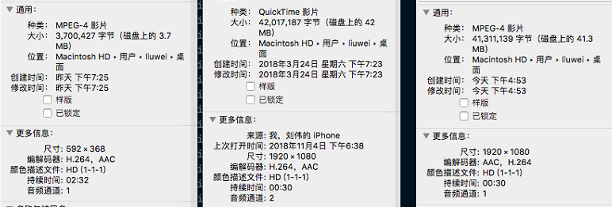

今天代码实现了从两个音视频文件中分别抽取音频、视频数据，并将这两种数据存储在一个新的MP4文件中，文件可以正常播放画面和声音，也就是实现一个最简版本的小咖秀。

前面几篇博客已经把需要的知识都讲了一遍，代码流程也基本一致，下面的代码看起来也会非常轻松。

源码实现：

```c
int ret = -1;
int err_code;
char errors[ERROR_STR_SIZE];

char *src_file1, *src_file2, *out_file;

AVFormatContext *ifmt_ctx1 = NULL;
AVFormatContext *ifmt_ctx2 = NULL;

AVFormatContext *ofmt_ctx = NULL;
AVOutputFormat *ofmt = NULL;

AVStream *in_stream1 = NULL;
AVStream *in_stream2 = NULL;

AVStream *out_stream1 = NULL;
AVStream *out_stream2 = NULL;

int audio_stream_index = 0;
int vedio_stream_indes = 0;

// 文件最大时长，保证音频和视频数据长度一致
double max_duration = 0;

AVPacket pkt;

int stream1 = 0, stream2 = 0;

av_log_set_level(AV_LOG_DEBUG);

src_file1 = argv[1];
src_file2 = argv[2];
out_file = argv[3];


//打开两个输入文件
if ((err_code = avformat_open_input(&ifmt_ctx1, src_file1, 0, 0)) < 0) {
    av_strerror(err_code, errors, ERROR_STR_SIZE);
    av_log(NULL, AV_LOG_ERROR,"Could not open src file, %s, %d(%s)\n",
           src_file1, err_code, errors);
    goto END;
}

if ((err_code = avformat_open_input(&ifmt_ctx2, src_file2, 0, 0)) < 0) {
    av_strerror(err_code, errors, ERROR_STR_SIZE);
    av_log(NULL, AV_LOG_ERROR,
           "Could not open the second src file, %s, %d(%s)\n",
           src_file2, err_code, errors);
    goto END;
}


//创建输出上下文
if ((err_code = avformat_alloc_output_context2(&ofmt_ctx, NULL, NULL, out_file)) < 0) {
    av_strerror(err_code, errors, ERROR_STR_SIZE);
    av_log(NULL, AV_LOG_ERROR, "Failed to create an context of outfile , %d(%s) \n",
           err_code, errors);
}

ofmt = ofmt_ctx->oformat;

// 找到第一个参数里最好的音频流和第二个文件中的视频流下标
audio_stream_index = av_find_best_stream(ifmt_ctx1, AVMEDIA_TYPE_AUDIO, -1, -1, NULL, 0);
vedio_stream_indes = av_find_best_stream(ifmt_ctx2, AVMEDIA_TYPE_VIDEO, -1, -1, NULL, 0);

// 获取第一个文件中的音频流
in_stream1 = ifmt_ctx1->streams[audio_stream_index];
stream1 = 0;
// 创建音频输出流
out_stream1 = avformat_new_stream(ofmt_ctx, NULL);
if (!out_stream1) {
    av_log(NULL, AV_LOG_ERROR, "Failed to alloc out stream!\n");
    goto END;
}
// 拷贝流参数
if ((err_code = avcodec_parameters_copy(out_stream1->codecpar, in_stream1->codecpar)) < 0) {
    av_strerror(err_code, errors, ERROR_STR_SIZE);
    av_log(NULL, AV_LOG_ERROR,
           "Failed to copy codec parameter, %d(%s)\n",
           err_code, errors);
}

out_stream1->codecpar->codec_tag = 0;

// 获取第二个文件中的视频流
in_stream2 = ifmt_ctx2->streams[vedio_stream_indes];
stream2 = 1;

// 创建视频输出流
out_stream2 = avformat_new_stream(ofmt_ctx, NULL);
if (!out_stream2) {
    av_log(NULL, AV_LOG_ERROR, "Failed to alloc out stream!\n");
    goto END;
}

// 拷贝流参数
if ((err_code = avcodec_parameters_copy(out_stream2->codecpar, in_stream2->codecpar)) < 0) {
    av_strerror(err_code, errors, ERROR_STR_SIZE);
    av_log(NULL, AV_LOG_ERROR,
           "Failed to copy codec parameter, %d(%s)\n",
           err_code, errors);
    goto END;
}

out_stream2->codecpar->codec_tag = 0;


av_dump_format(ofmt_ctx, 0, out_file, 1);

// 判断两个流的长度，确定最终文件的长度
if (in_stream1->duration * av_q2d(in_stream1->time_base) > in_stream2->duration * av_q2d(in_stream2->time_base)) {
    max_duration = in_stream2->duration * av_q2d(in_stream2->time_base);
} else {
    max_duration = in_stream1->duration * av_q2d(in_stream1->time_base);
}

//打开输出文件
if (!(ofmt->flags & AVFMT_NOFILE)) {
    if ((err_code = avio_open(&ofmt_ctx->pb, out_file, AVIO_FLAG_WRITE)) < 0) {
        av_strerror(err_code, errors, ERROR_STR_SIZE);
        av_log(NULL, AV_LOG_ERROR,
               "Could not open output file, %s, %d(%s)\n",
               out_file, err_code, errors);
        goto END;
    }
}

//写头信息
avformat_write_header(ofmt_ctx, NULL);

av_init_packet(&pkt);

// 读取音频数据并写入输出文件中
while (av_read_frame(ifmt_ctx1, &pkt) >= 0) {
    // 如果读取的时间超过了最长时间表示不需要该帧，跳过
    if (pkt.pts * av_q2d(in_stream1->time_base) > max_duration) {
        av_packet_unref(&pkt);
        continue;
    }
	// 如果是我们需要的音频流，转换时间基后写入文件
    if (pkt.stream_index == audio_stream_index) {
        pkt.pts = av_rescale_q_rnd(pkt.pts, in_stream1->time_base, out_stream1->time_base,
                                   (AV_ROUND_NEAR_INF | AV_ROUND_PASS_MINMAX));
        pkt.dts = av_rescale_q_rnd(pkt.dts, in_stream1->time_base, out_stream1->time_base,
                                   (AV_ROUND_NEAR_INF | AV_ROUND_PASS_MINMAX));
        pkt.duration = av_rescale_q(max_duration, in_stream1->time_base, out_stream1->time_base);
        pkt.pos = -1;
        pkt.stream_index = stream1;
        av_interleaved_write_frame(ofmt_ctx, &pkt);
        av_packet_unref(&pkt);
    }
}


// 读取视频数据并写入输出文件中
while (av_read_frame(ifmt_ctx2, &pkt) >= 0) {
    
	// 如果读取的时间超过了最长时间表示不需要该帧，跳过
    if (pkt.pts * av_q2d(in_stream2->time_base) > max_duration) {
        av_packet_unref(&pkt);
        continue;
    }
	// 如果是我们需要的视频流，转换时间基后写入文件
    if (pkt.stream_index == vedio_stream_indes) {
        pkt.pts = av_rescale_q_rnd(pkt.pts, in_stream2->time_base, out_stream2->time_base,
                                   (AV_ROUND_NEAR_INF | AV_ROUND_PASS_MINMAX));
        pkt.dts = av_rescale_q_rnd(pkt.dts, in_stream2->time_base, out_stream2->time_base,
                                   (AV_ROUND_NEAR_INF | AV_ROUND_PASS_MINMAX));
        pkt.duration = av_rescale_q(max_duration, in_stream2->time_base, out_stream2->time_base);
        pkt.pos = -1;
        pkt.stream_index = stream2;
        av_interleaved_write_frame(ofmt_ctx, &pkt);
        av_packet_unref(&pkt);
    }
}

//写尾信息
av_write_trailer(ofmt_ctx)；

ret = 0;

END:
// 释放内存
if (ifmt_ctx1) {
    avformat_close_input(&ifmt_ctx1);
}

if (ifmt_ctx2) {
    avformat_close_input(&ifmt_ctx2);
}

if (ofmt_ctx) {
    if (!(ofmt->flags & AVFMT_NOFILE)) {
        avio_closep(&ofmt_ctx->pb);
    }
    avformat_free_context(ofmt_ctx);
}
```

最终效果如下，从左到右：输入1、输入2、输出文件。输出文件拿到了输入1的音频、输入2的视频信息，并且时长为输入2的时长。





目前只是在做C语言开发，后面会慢慢把重心移到Android平台上，在FFmpeg和Android平台的基础上玩更多有意思的东西。