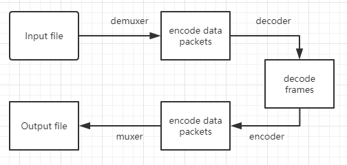

FFmpeg 是一套可以用来记录、转换数字音频、视频，并能将其转化为流的开源计算机程序。本文将简单介绍FFmpeg库的基本目录结构及其功能，然后会介绍一些常用的FFmpeg命令，了解FFmpeg到底能做些什么。

### 音视频基本处理流程

对于音视频的处理基本遵循下面的流程：

### FFmpeg目录及功能

| libavcodec    | 提供了一系列编解码器的实现                                   |
| ------------- | ------------------------------------------------------------ |
| libavcodec    | 用于各种音视频封装格式的生成和解析，包括获取解码所需信息以生成解码上下文结构和读取音视频帧等功能 |
| libavutil     | 包含一些公共的工具函数                                       |
| libavutil     | 提供了各种音视频过滤器                                       |
| libavdevice   | 提供了各种音视频过滤器                                       |
| libswscale    | 提供了视频场景比例缩放、色彩映射转换功能                     |
| libswresample | 实现了混音和重采样                                           |

### 信息查询命令

| 命令            | 作用                             |
| --------------- | -------------------------------- |
| FFmpeg -version | 显示版本                         |
| -formats        | 显示可用的格式（包括设备）       |
| -demuxers       | 显示可用的demuxers               |
| -muxers         | 显示可用的muxers                 |
| -devices        | 显示可用的设备                   |
| -codecs         | 显示已知的所有编解码器           |
| -decoders       | 显示可用的解码器                 |
| -encoders       | 显示所有可用的编码器             |
| -bsfs           | 显示可用的比特流filter           |
| -protocols      | 显示可用的协议                   |
| -filters        | 显示可用的过滤器                 |
| -pix_fmts       | 显示可用的像素格式               |
| -sample_fmts    | 显示可用的采样格式               |
| -layouts        | 显示channel名称和标准channel布局 |
| -colors         | 显示识别的颜色名称               |

## 设备列表

`ffmpeg -f avfoundation -list_devices true -i “”`

查看Mac上支持的设备列表

## 录屏

`ffmpeg -f avfoundation -i 1 -r 30 out.yuv`

-f 指定使用 avfoundation 采集数据。
-i 指定从哪儿采集数据，它是一个文件索引号。
-r 指定帧率。

## 录屏+声音

`ffmpeg -f avfoundation -i 1:0 -r 29.97 -c:v libx264 -crf 0 -c:a libfdk_aac -profile:a aac_he_v2 -b:a 32k out.flv`

-i 1:0 冒号前面的 “1” 代表的屏幕索引号。冒号后面的"0"代表的声音索相号。
-c:v 与参数 -vcodec 一样，表示视频编码器。c 是 codec 的缩写，v 是video的缩写。
-crf 是 x264 的参数。 0 表式无损压缩。
-c:a 与参数 -acodec 一样，表示音频编码器。
-profile 是 fdk_aac 的参数。 aac_he_v2 表式使用 AAC_HE v2 压缩数据。
-b:a 指定音频码率。 b 是 bitrate的缩写, a是 audio的缩与。

## 抽取音频和视频

`ffmpeg -i input_file -vcodec copy -an output_file_video　　//分离视频流`

`ffmpeg -i input_file -acodec copy -vn output_file_audio　　//分离音频流`

vcodec: 指定视频编码器，copy 指明只拷贝，不做编解码。

an: a 代表视频，n 代表 no 也就是无音频的意思。

acodec: 指定音频编码器，copy 指明只拷贝，不做编解码。

vn: v 代表视频，n 代表 no 也就是无视频的意思。

## 转格式

`ffmpeg -i test.mp4 -vcodec copy -acodec copy test.flv`

音频、视频都直接 copy，只是将 mp4 的封装格式转成了flv

## 音视频合并

`ffmpeg -i out.h264 -i out.aac -vcodec copy -acodec copy out.mp4`

视频和音频直接拷贝，合成一个mp4格式文件

## YUV转H264

`ffmpeg -f rawvideo -pix_fmt yuv420p -s 320x240 -r 30 -i out.yuv -c:v libx264 -f rawvideo out.h264`

## 合并

首先创建一个 inputs.txt 文件，文件内容如下：
file '1.flv’
file '2.flv’
file '3.flv’
然后执行下面的命令：
`ffmpeg -f concat -i inputs.txt -c copy output.flv`

## 视频剪切

`ffmpeg -ss 0:1:30 -t 0:0:20 -i input.avi -vcodec copy -acodec copy output.avi //剪切视频`
-ss 开始时间
-t 持续时间

## 视频缩小一倍

`ffmpeg -i out.mp4 -vf scale=iw/2:-1 scale.mp4`
-vf scale 指定使用简单过滤器 scale，iw/2:-1 中的 iw 指定按整型取视频的宽度。 -1 表示高度随宽度一起变化。

## 视频图片互转

`ffmpeg -i test.flv -r 1 -f image2 image-%3d.jpeg  //视频转JPEG`
`ffmpeg -i out.mp4 -ss 00:00:00 -t 10 out.gif  //视频转gif`
`ffmpeg -f image2 -i image-%3d.jpeg images.mp4 //图片转视频`

## 添加水印

`ffmpeg -i out.mp4 -vf “movie=logo.png,scale=64:48[watermask];[in][watermask] overlay=30:10 [out]” water.mp4`

-vf中的 movie 指定logo位置。scale 指定 logo 大小。overlay 指定 logo 摆放的位置

## 直播推流

`ffmpeg -re -i out.mp4 -c copy -f flv rtmp://server/live/streamName`

## 直播拉流保存

`ffmpeg -i rtmp://server/live/streamName -c copy dump.flv`