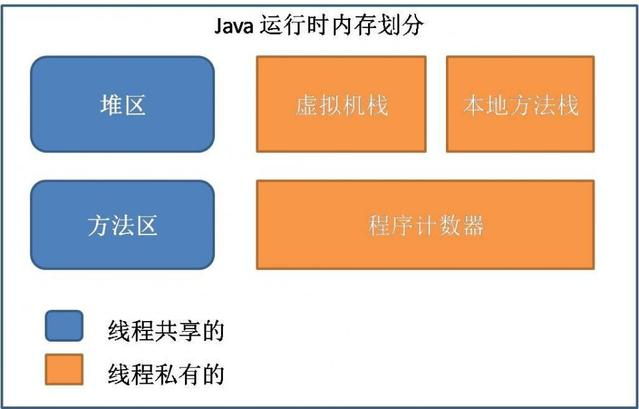

最近要准备面试了，今天特意复习一下内存分配和GC相关知识。

## Java内存管理

#### 程序计数器

程序计数器是用于存储每个线程下一步将执行的JVM指令，如该方法为native的，则程序计数器中不存储任何信息。
	
#### 虚拟机栈
一个线程的每个方法在执行的同时，都会创建一个栈帧（Statck Frame），栈帧中存储的有局部变量表、操作站、动态链接、方法出口等，当方法被调用时，栈帧在JVM栈中入栈，当方法执行完成时，栈帧出栈。

每个线程对应着一个虚拟机栈，因此虚拟机栈也是线程私有的。

#### 堆区

堆区是理解Java GC机制最重要的区域，没有之一。在JVM所管理的内存中，堆区是最大的一块，堆区也是Java GC机制所管理的主要内存区域，堆区由所有线程共享，在虚拟机启动时创建。堆区的存在是为了存储对象实例，原则上讲，所有的对象都在堆区上分配内存（不过现代技术里，也不是这么绝对的，也有栈上直接分配的）。

#### 方法区

在Sun JDK中这块区域对应的为PermanetGeneration，又称为永久代。方法区域存放了所加载的类的信息（名称、修饰符等）、类中的静态变量、类中定义为final类型的常量、类中的Field信息、类中的方法信息，当开发人员在程序中通过Class对象中的getName、isInterface等方法来获取信息时，这些数据都来源于方法区域，同时方法区域也是全局共享的，在一定的条件下它也会被GC，当方法区域需要使用的内存超过其允许的大小时，会抛出OutOfMemory的错误信息。
 
#### 本地方法栈
 
　　JVM采用本地方法栈来支持native方法的执行，此区域用于存储每个native方法调用的状态。
 
#### 运行时常量池
　　存放的为类中的固定的常量信息、方法和Field的引用信息等，其空间从方法区域中分配。JVM在加载类时会为每个class分配一个独立的常量池，但是运行时常量池中的字符串常量池是全局共享的。
　　
#### 直接内存
直接内存并不是JVM管理的内存，可以这样理解，直接内存，就是JVM以外的机器内存，比如，你有4G的内存，JVM占用了1G，则其余的3G就是直接内存，JDK中有一种基于通道（Channel）和缓冲区（Buffer）的内存分配方式，将由C语言实现的native函数库分配在直接内存中，用存储在JVM堆中的DirectByteBuffer来引用。由于直接内存收到本机器内存的限制，所以也可能出现OutOfMemoryError的异常。

## Java内存回收机制

Java内存分配和回收的机制概括的说，就是：分代分配，分代回收。对象将根据存活的时间被分为：年轻代（Young Generation）、年老代（Old Generation）、永久代（Permanent Generation，也就是方法区）。

### 年轻代（Young Generation）
对象被创建时，内存的分配首先发生在年轻代（大对象可以直接被创建在年老代），大部分的对象在创建后很快就不再使用，因此很快变得不可达，于是被年轻代的GC机制清理掉（IBM的研究表明，98%的对象都是很快消亡的），这个GC机制被称为Minor GC或叫Young GC。注意，Minor GC并不代表年轻代内存不足，它事实上只表示在Eden区上的GC。

新生代又被进一步划分为Eden(伊甸，初次创建)和Survivor(存活)区，Survivor区又分为Survivor1和Survivor2。这里为什么要将Young划分为Eden、Survivor1、Survivor2这三块，给出的解释是：

> “Young中的98%的对象都是死朝生夕死，所以将内存分为一块较大的Eden和两块较小的Survivor1、Survivor2，JVM默认分配是8:1:1，每次调用Eden和其中的Survivor1，当发生回收的时候，将Eden和Survivor1存活的对象复制到Survivor2，然后直接清理掉Eden和Survivor1的空间。”

内存分配过程如下图：

### 年老代（Old Generation）
对象如果在年轻代存活了足够长的时间而没有被清理掉（即在几次Young GC后存活了下来），则会被复制到年老代，年老代的空间一般比年轻代大，能存放更多的对象，在年老代上发生的GC次数也比年轻代少。当年老代内存不足时，将执行Major GC，也叫 Full GC。

### 分代收集

#### 年轻代
在年轻代中，使用“停止-复制”算法进行清理，将新生代内存分为2部分，1部分 Eden区较大，1部分Survivor比较小，并被划分为两个等量的部分。每次进行清理时，将Eden区和一个Survivor中仍然存活的对象拷贝到 另一个Survivor中，然后清理掉Eden和刚才的Survivor。

#### 老年代

老年代存储的对象比年轻代多得多，而且不乏大对象，对老年代进行内存清理时，如果使用停止-复制算法，则相当低效。一般，老年代用的算法是标记-整理算法，即：标记出仍然存活的对象（存在引用的），将所有存活的对象向一端移动，以保证内存的连续。

#### 方法区（永久代）

永久代的回收有两种：常量池中的常量，无用的类信息，常量的回收很简单，没有引用了就可以被回收。对于无用的类进行回收，必须保证3点：

1. 类的所有实例都已经被回收
2. 加载类的ClassLoader已经被回收
3. 类对象的Class对象没有被引用（即没有通过反射引用该类的地方）

## 问题
以下是在看其他博客时看到的一个挺不错的问题。[原文链接](https://www.cnblogs.com/wjtaigwh/p/6635484.html)

> 思考“GC是在什么时候，对什么东西，做了什么事情？”

#### 什么时候
从字面上翻译过来就是什么时候触发我们的GC机制

① 在程序空闲的时候。这个回答无力吐槽

② 程序不可预知的时候/手动调用system.gc()。关于手动调用不推荐

③ Java堆内存不足时,GC会被调用。当应用线程在运行,并在运行过程中创建新对象,若这时内存空间不足,JVM就会强制地调用GC线程,以便回收内存用于新的分配。若GC一次之后仍不能满足内存分配的要求,JVM会再进行两次GC作进一步的尝试,若仍无法满足要求,则 JVM将报“out of memory”的错误,Java应用将停止。

#### 什么东西
从字面的意思翻译过来就是能被GC回收的对象都有哪些特征

①超出作用域的对象/引用计数为空的对象。

> 引用计数算法：给对象中添加一个引用计数器，每当有一个地方引用它时，计数器就加1；当引用失效时，计数器值就减1；任何时刻计数器都为0的对象就是不可能再被使用的。

②从GC Root开始搜索，且搜索不到的对象

> 跟搜索算法：以一系列名为 GC Root的对象作为起点，从这些节点开始往下搜索，搜索走过的路径称为引用链，当一个对象到GC Roots没有任何引用链的时候，则就证明此对象是不可用的。
> 
> 这里会提出一个思考，什么样的对象能成为GC Root ： 虚拟机中的引用的对象、方法区中的类静态属性引用的对象、方法区中常量引用的对象、本地方法栈中jni的引用对象。

③从root搜索不到，而且经过第一次标记、清理后，仍然没有复活的对象。

#### 做什么
不同年代、不同种类的收集器很多，不过总体的作用是删除不使用的对象，腾出内存空间。补充一些诸如停止其他线程执行、运行finalize等的说明。