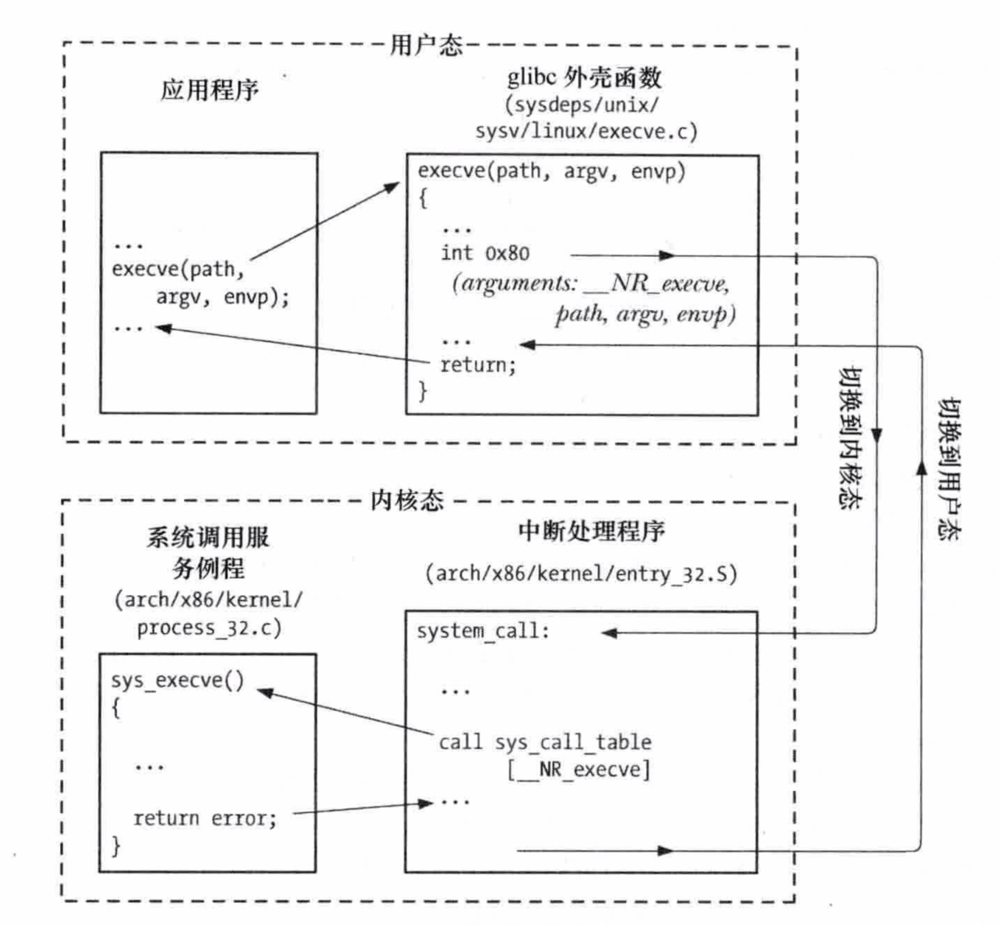
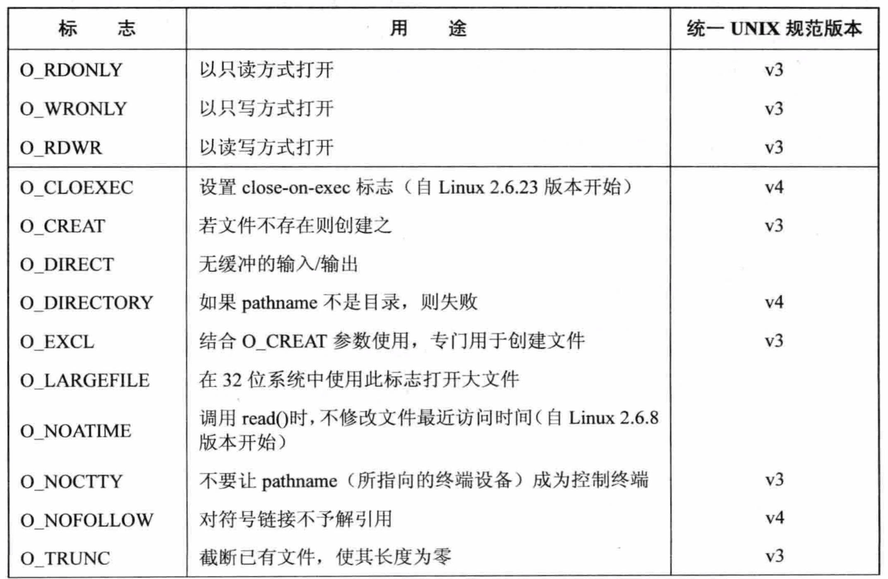
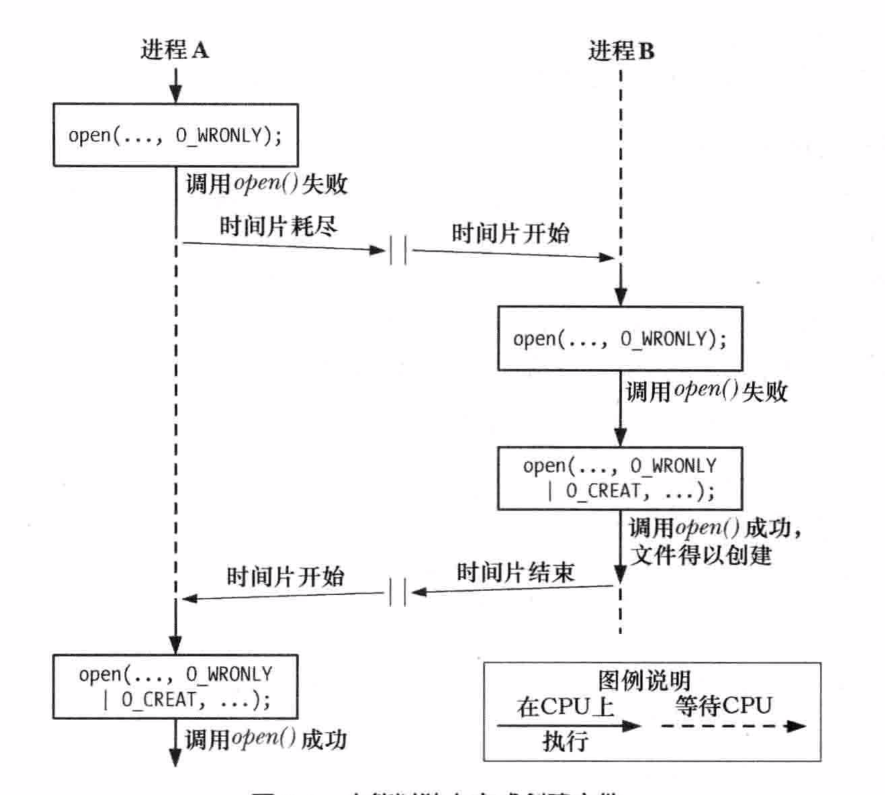
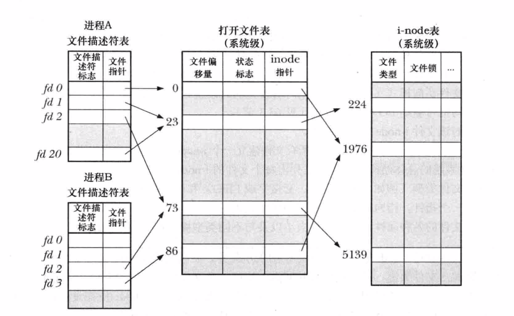

## 系统调用

系统调用是受控的内核入口，借助这一机制，进程可以请求内核以自己的名义去执行某些操作。以应用程序编程接口（API）的形式，内核提供有一系列服务供程序访问。

> - 系统调用将处理器从用户态切换到核心态，以便CPU访问受到保护的内核内存
> - 系统调用的组成是固定的，每个系统调用都由一个唯一的数字来标识。(程序通过名称来标识系统调用，对这一编号方案往往一无所知)
> - 每个系统调用可辅之以一套参数，对用户空间(亦即进程的寻你地址空间)与内核空间之间传递的信息加以规范。

从编程角度来看，系统调用和C语言函数的调用很相似。然而，在执行系统调用时，其幕后会经历诸多步骤。以一个具体的硬件平台-x86-32为例，按事件发生的顺序对这些步骤加以分析。

1. 应用程序调用C语言函数库中的外壳（wrapper）函数，来发起系统调用。
2. 对系统调用中断处理例程来说，外壳函数必须保证所有的系统调用参数可用，通过堆栈，这些参数传入外壳函数，但内核却希望将这些参数置入特定寄存器。因此，外壳函数会讲上述参数复制到寄存器。
3. 由于所有系统调用进入内核的方式相同，内核需要去区分每个系统调用。为此外壳函数会讲系统调用编号复制到一个特殊的CPU寄存器（%eax）中。
4. 外壳函数执行一条中断机器指令（int 0x80），引发处理器从用户态切换到核心态，并执行系统中断0x80的中断矢量所指向的代码。
5. 为响应中断0x80，内核会调用system_call()例程来处理这次中断，具体如下：
   - 在内核栈中保存寄存器值
   - 审核系统嗲用编号的有效性
   - 以系统调用编号对存放所有调用服务例程的列表（内核变量sys_call_table）进行索引，发现并调用相应的系统调用服务例程。若系统调用服务例程带有参数，那么将首先检查参数的有效性。最后，该服务例程会将结果状态放回给system_call()例程
   - 从内核栈中恢复各寄存器值，并将系统调用返回值置于栈中
   - 返回至外壳函数，同时将处理器切换回用户态
6. 若系统调用服务例程的返回值表明调用有误，外壳函数会使用该值来设置全局变量errno。然后，外壳函数会返回到调用程序，并同时返回一个整型值，以表明系统调用是否成功。

下图以系统调用execve()为例



## 1、文件I/O

所有执行I/O操作的系统嗲用都以文件描述符，一个非负整数(通常是小整数)，来指代打开的文件。文件描述符用以表示所有类型的已打开文件，包括管道(pipe)、FIFO、socket、终端、设备和普通文件。针对每个进程，文件描述符都自成一套。

### 1.1通用I/O

UNIX I/O模型的显著特点之一是其输入/输出的通用性概念。这就意味着使用4个同样的系统调用open()、read()、wrtie()和close()可以对所有类型的文件执行I/O操作，包括终端之类的设备。

### 1.2打开一个文件：open()

open()调用既能打开一个已存在的文件，也能创建并打开一个新文件

```c
#include <sys/stat.h>
#include <fcntl.h>

int open(const char *pathname,int flags,.../* mode_t mode*/);
             
                                              Return file descriptor on success,or -1 on error 
```

参数flags为位掩码，用于制定文件的访问模式，可选下表所示的常量之一。


open函数使用的例子

```c
//只读方式打开已存在的文件
fd = open("startup",o_RDONLY);
if(fd == -1)
   errExit("open");

// 读写方式打开或创建文件，清空文件内容
fd = open("myfile",O_RD_WD | O_CREAT | O_TRUNNC, S_IRUSR | S_IWUSR);
if(fd == -1)
   errExit("open");

// 打开或创建只写的文件，清空文件内容，总在文件尾部追加数据
fd = open("w.log",O_WRONLY | O_CREAT | O_TRUNNC | O_APPEND, S_IRUSR | S_IWUSR);
if(fd == -1)
   errExit("open");
```

**open()中flags参数**




### 1.3读取文件内容：read()

read()系统调用从文件描述符fd所指代的打开文件中读取数据。

```c
#include <unistd.h>

ssize_t read(int fd,void *buffer,size_t count);
																				Returns number of bytes read,0on EOF,or -1 on error
```

count 参数指定最多能读取的字节数。buffer参数提供用来存放输入数据的内存缓冲区地址。缓冲区至少有count个字节。

### 1.4数据写入文件：write()

write()系统调用将数据写入一个已打开的文件中。

```c
#include <unistd.h>

ssize_t write(int fd,void *buffer,size_t count);
																				Returns number of bytes wrttten,or -1 on error
```

### 1.5关闭文件：close()

close()系统调用关闭一个打开的文件描述符，并将其释放回调用进程，供该进程继续使用。当一进程终止时，将自动关闭其已打开的所有文件描述符。

```c
#include <unistd.h>

int close(int fd);
																				              Returns 0 on success,or -1 on error
```

### 1.6改变文件偏移量：lseek()

对于每个打开的文件，系统内核会记录其文件偏移量，有时也将文件偏移量称为读写偏移量或指针。文件偏移量是指执行下一个read()或write()操作的文件起始位置，会以相对于文件头部起始点的文件当前位置脸表示。文件第一个字节的偏移量为0。

文件打开时，会将文件偏移量设置为指向文件开始，以后每次read()或write()调用将自动对其进行调整，以指向已读或已读数据后的下一字节。因此，连续read()或write()调用将按顺序递进，对文件进行操作。

针对文件描述符fd参数所指代的已打开文件，lseek()系统调用依照offset和whence参数调整该文件的偏移量

```c
#include <unistd.h>

off_t lseek(int fd,off_t offset,int whence);
								Returns new file offset if successful,or -1 on error
```

offset参数指定了一个以字节为单位的数值。whence参数则表明应参照哪个基点来解释offset参数，应为下列其中之一：

**SEEK_SET:** 

​			将文件偏移量设置为从文件头部起始点开始的offset个字节。

**SEEK_CUR：**

​			相对于当前文件偏移量，将文件偏移量调整offset个字节。

**SEEK_END：**

​			将文件偏移量设置为起始于文件尾部的offset个字节。也就是说，offset参数应该从文件最后一个字节之后的下一个字节算起。


####文件空洞

如果程序的文件偏移量已然跨越了文件结尾，然后再执行I/O操作，read()会返回0，表示文件结尾。write()函数可以在文件结尾后的任意位置写入数据。

从文件结尾后到新写入数据间的这段空间被称为文件空洞。从编程角度看，文件空洞中是存在字节的，读取空洞将返回以0（空字节）填充的缓冲区。

然而，文件空洞不占用任何磁盘空间。直到后续某个时点，在文件空洞中写入了数据，文件系统才会为之分配磁盘块。文件空洞的主要优势在于，与为实际需要的空字节分配磁盘块相比，稀疏填充的文件会占用较少的磁盘空间。 

### 1.7通用I/O模型以外的操作：ioctl()

```c
#include <sys/ioctl.h>

int ioctl(int fd,int request,.../* argp */);
 															Value returned on success depends on request,or -1 on error
```

## 2、深入探究文件I/O

### 2.1 原子操作和竞争条件

所有系统调用都是以原子操作方式执行的。内核保证了某系统调用中的所有步骤会作为独立操作而一次性加以执行，其间不会为其它进程或线程所中断。

原子性是某些操作得以圆满成功的关键所在。特别是它规避了竞争状态。竞争状态是这样一种情形：操作共享资源的两个进程或线程，其结果取决于一个无法预期的顺序，即这些进程获得CPU使用权的先后相对顺序。

**以独占方式创建一个文件**

当同时指定O_EXCL与O_CREAT作为open()的标志位时，如果要打开的文件已经存在，则open()将返回一个错误。这提供了一种机制，保证进程是打开文件的创建者。对文件是否存在的检查和创建文件属于同一原子操作。而当代码中没有使用O_EXCL标志时。



如果两个进程如上图所示流程运行，两个进程都会声称自己以独占方式创建了文件。

由于第一个进程在检查文件是否存在和创建文件之间发生了中断，造成两个进程都声称自己是文件的创建者。结合O_CREAT和O_EXCL标志来一次性调用open()可以防止这种情况，因为这确保了检查文件和创建文件的步骤属于一个单一的原子(不可中断的)操作。

### 2.2 文件控制操作：fcntl()

fcntl()系统调用对一个打开的文件描述符执行一系列控制操作。

```c
#include <fcntl.h>

int fcntl(int fd,int cmd,...);
															Return on success depends on cmd,or -1 onn error
```

cmd参数所支持的操作范围很广，下面会加以研讨。

### 2.3 打开文件的状态标志

fcntl()的用途之一是针对一个打开的文件，获取或修改其访问模式和状态标志(这些值是通过指定open()调用的flag参数来设置的)。要获取这些设置，应将fcntl()的cmd参数设置为F_GETFL。

```c
int flags，accessMode;
flags = fcntl(fd,F_GETFL);
if(flage == -1)
   errRxit("fcntl");

if(flags & O_SYNC)  // 测试文件是否以同步写方式打开
	 printf("writes are synchronized\n");
```

判定文件的访问模式有一点复杂，这是因为O_RDONLY(0)、O_WRONLY(1)和O_RDWR(2)这3个常量并不与打开文件状态标志中的单个比特位对应。因此，要判定访问模式，需使用掩码O_ACCMODE与flag相与，将结果与3个常量进行比对，示例代码：

```c
accessMode = flags & O_ACCMODE;
if(accessMode == O_WRONLY || accessMode == O_RDWR)
		printf("file is writable\n");
```

可以使用fcntl()的F_SETFL 命令来修改打开文件的某些状态标志。允许更改的标志有O_APPEND、O_NONBLOCK、O_NOATIME、O_ASYNC和O_DIRECT。

使用fcntl()修改文件状态标志，尤其适用如下场景。

- 文件不是有调用程序打开的，所以程序也无法使用open()调用来控制文件的状态标志。
- 文件描述符的获取是通过open()之外的系统调用。比如pipe()调用，该调用创建一个管道，并返回两个文件描述符分别对应管道的两端。再比如socket()调用，该调用创建一个套接字并返回指向该套机诶字的文件描述符。

例如，为了添加O_APPEND标志：

```c
int flags;

flags  = fnctl(fd,F_GETFL);
if(flags == -1)
	 errExit("fcntl");
flags |= O_APPEND;
if(fcntl(fd,F_SETFL,flags) == -1)
   errExit("fcntl");
```

### 2.4 文件描述符和打开文件之间的关系

到目前为止，文件描述符和打开文件之前似乎呈现出一一对应的关系。然而，实际并非如此。多个文件描述符指向同一打开文件，这既有可能，也属必要。这些文件描述符可在相同或不同的进程中打开。

要理解具体情况如何，需要查看由内核维护的3个数据结构。

- 进程级的文件描述符表。
- 系统级的打开文件表。
- 文件系统的i-node表。

针对每个进程，内核为其维护打开文件的描述符(open file descriptor)表。该表的每一条目都记录了单个文件描述符的相关信息。

内核对所有打开的文件维护有一个系统级的描述表格(opeb file description table)。也可称为打开文件表(open file table)，并将表中各条目称为打开文件句柄(open file handle)。一个打开文件句柄存储了与一个打开文件相关的全部信息.

- 当前文件偏移量
- 打开文件时所使用的状态标志
- 文件访问模式
- 与信号驱动I/O相关的设置
- 对该文件i-node 对象的引用

每个文件系统都会为驻留其上的所有文件建立一个i-node表。每个文件的i-node信息

- 文件类型和访问权限
- 一个指针，指向该文件所持有的锁的列表
- 文件的各种属性，包括文件大小以及不同类型操作相关的时间戳



### 2.5复制文件描述符

Bourne shell的I/O重定向语法 2>&1，意在通知shell把标准错误(文件描述符2)重定向到标准输入(文件描述符1)。

dup()调用复制一个打开的文件描述符oldfd，并返回一个新描述符，二者都指向同一个打开的文件句柄。系统会保证新描述符一定是编号值最低的未用文件描述符。

```c
#include <unistd.h>

int dup(int oldfd);

							Returns(new)file descriptor on success,or -1 on error
```

例如：

`newfd= dup(1);`

在假定正常情况下，shell已经代表程序打开了文件描述符0，1和2，且没有其它描述符在用，dup()调用会创建文件描述符1的副本，返回的文件描述符编号值为3。

```c
#include <unistd.h>

int dup2(int oldfd，int newfd);

							Returns(new)file descriptor on success,or -1 on error
```

dup2()系统调用会为oldfd参数所指定的文件描述符创建副本，其编号由newfd参数指定。如果由newfd参数所指定的文件描述符之前已经打开，那么dup2()会先将其关闭。

fcntl()的F_DUPFD操作是复制文件描述符的另一接口，更具灵活性。

`newfd = fcntl(oldfd,F_DUPFD,startfd);`

该调用为oldfd创建一个副本，且将使用大于等于startfd的最小未用值作为描述符编号。

dup3()系统调用完成的工作与dup2()相同，只是增加了一个附加参数flag，这是一个可以修改系统调用行为的位掩码。

```c
#define _GUN_SOURCE
#include <unistd.h>

int dup3(int oldfd，int newfd,int flags);

							Returns(new)file descriptor on success,or -1 on error
```

目前，dup3()只支持一个标志O_CLOEXEC,这将促使内核为新文件描述符设置close-on-exec标志(FD_CLOEXEC)。

### 2.6 在文件特定偏移量处的I/O：pread()和pwrite()

系统调用pread()和pwrite()完成与read()和write()相类似的工作，只是前两者会在offset参数所指定的位置进行文件I/O操作，而非始于文件的当前偏移量处，且它们不会改变文件的当前偏移量。

```c
#include <unistd.h>

ssize_t pread(int fd,void *buf,size_t count,off_t offset);
								 Returns number of bytes read,0 on EOF,or -1 on error
ssize_t pwrite(int fd,const void *buf,size_t count,off_t offset);
								       Returns number of bytes written,or -1 on error
```

pread()调用等于将如下调用纳入同一原子操作：

```c
off_t orig;

orig = lseek(fd,0,SEEK_CUR);  //保存当前偏移量
lseek(fd,offset,SEEK_SET);
s= read(fd,buf,len);
lseek(fd,orig,SEEK_SET); //恢复原本的偏移量
```

### 2.7 分散输入和集中输出(Scatter-Gather I/O):readv()和writev()

```c
#include <sys/uio.h>

ssize_t readv(int fd,const struct iovec *iov,int iovcnt);
							Returns number of bytes read,0 on EOF,or -1 on error
							
ssize_t writev(int fd,const struct iovec *iov,int iovcnt);
							Returns number of bytes written,or -1 on error
```

readv()实现了分散输入的功能：从文件描述符fd所指代的文件中读取一片连续的字节，然后将其分散放置于iov指定的缓冲区中。这一散置动作从iov[0]开始，一次填满每个缓冲区。

writev()将iov所指定的所有缓冲区中的数据拼接起来，然后以连续的字节序列写入文件描述符fd所指代的文件中。

### 2.8截断文件：truncate()和ftruncate()系统调用

truncate()和ftruncate()将文件大小设置为length参数指定的参数。

```c
#include <unistd.h>

int truncate(const char *pathname,off_t length);
int ftruncate(int fd,off_t length);

											Both return 0 on success,or -1 on error
```

若文件当前长度大于参数length，调用将丢弃超出部分，若小于参数length，调用将在文件尾部添加一系列空字节或是一个文件空洞。

### 2.9 创建临时文件

```c
#include <stdlib.h>

int mkstemp(char *tempplate);

									Returns file descriptor on success,or -1 on error
```

基于调用者提供的模版，mkstemp()函数声称一个唯一文件名并打开该文件，返回一个可用于I/O调用的文件描述符。

模版参数采用路径名形式，其中最后6个字符必须为XXXXXX。这6个字符将被替换，以保证文件名的唯一性，且修改后的字符串将通过template参数传回。

```c
#include <stdio.h>

FILE *tmpfile(void);

									return file pointer on success,or NULL on error 
```

tmpfile()函数执行成功，将返回一个文件流供stdio库函数使用。文件流关闭后将自动删除临时文件。

## 进程

### 3.1进程号和父进程号

返回调用进程的进程号

```c
#include <unistd.h>

pid_t getpid(void);
     
     						Always successfully returns peocess ID of caller
```

每个进程都有一个创建自己的父进程，getppid()可以获取父进程的进程号。

```c
#include <unistd.h>

pit_t getppid(void);

			Always successfully returns peocess ID of parent of caller
```


## 内存分配

