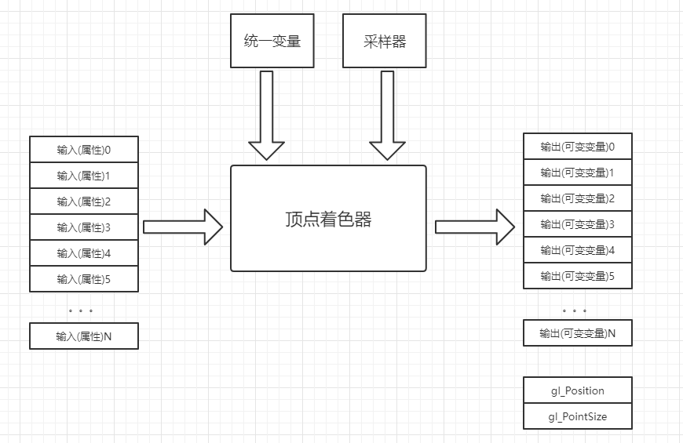
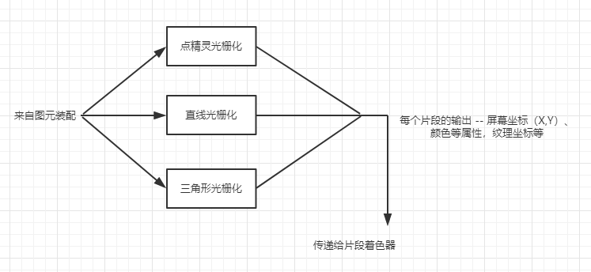
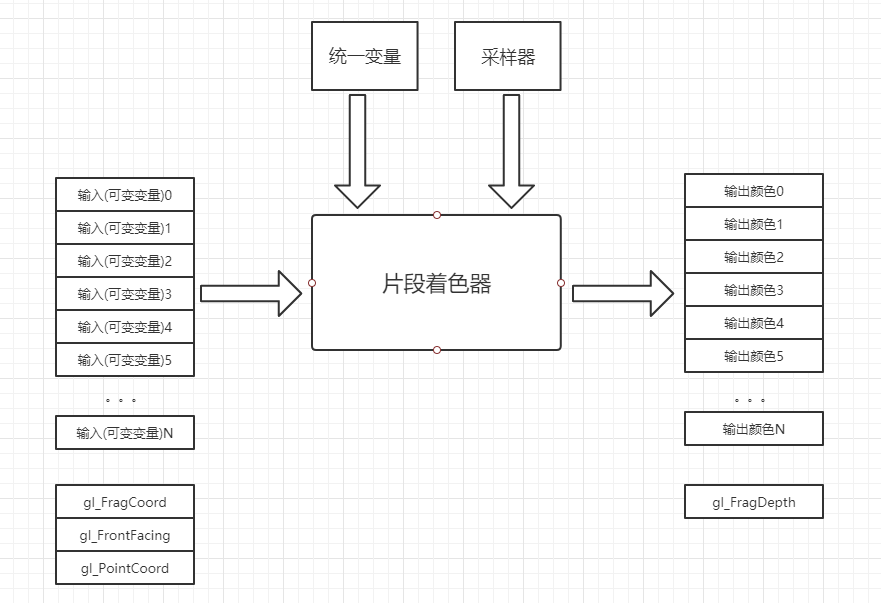

> OpenGL ES (OpenGL for Embedded Systems) 是 OpenGL 三维图形 API 的子集，针对手机、PDA和游戏主机等嵌入式设备而设计。该API由Khronos集团定义推广，Khronos是一个图形软硬件行业协会，该协会主要关注图形和多媒体方面的开放标准。

### OpenGL 渲染流程

一个用来渲染图像的OpenGL程序需要执行的主要操作如下所示：

- 从OpenGL的几何图元中设置数据 ，用于构建图形。
- 使用不同的着色器(shader)对输入的图元数据执行计算操作，判断它们的位置、颜色，以及其他渲染属性。
- 将输入图原点额数学描述转换为与屏幕位置相对应的像素片元(fragment)。这一步也被称为光栅化(rasterization)。
- 最后，针对光栅化过程产生的每个片元，执行片元着色器(fragment shader)，从而决定这个片元的最终颜色和位置。
- 如果有必要，还需要对每个片元执行一些额外的操作，例如判断片元对应的对象是否可见，或者将片元的颜色与当前屏幕位置的颜色进行融合。

OpenGL是使用客户端 - 服务端的形式实现的，我们编写的应用程序可以看做客户端，而计算机图形硬件厂商所提供的OpenGL实现可以看做服务端。

### OpenGL ES对Android平台的支持情况

OpenGL ES当前主要版本有1.0/1.1/2.0/3.0/3.1。

| OpenGL ES版本 | Android版本           | 描述                                                         |
| ------------- | --------------------- | ------------------------------------------------------------ |
| OpenGL ES1.0  | Ａndroid 1.0+         | OpenGL ES 1.x是针对固定硬件管线的，Ａndroid 1.0和更高的版本支持这个API规范。 |
| OpenGL ES2.0  | Android 2.2(API 8)+   | OpenGL ES 2.x是针对可编程硬件管线的，不兼容OpenGL ES 1.x，Android 2.2(API 8)和更高的版本支持这个API规范。 |
| OpenGL ES3.0  | Android 4.3(API 18)+  | 向下兼容OpenGL ES 2.x，Android 4.3(API 18)及更高的版本支持这个API规范。 |
| OpenGL ES3.1  | Android 5.0 (API 21)+ | 向下兼容OpenGL ES3.0/2.0，Android 5.0（API 21）和更高的版本支持这个API规范 |

### OpenGL ES 3.0主要新功能有：

- 1、渲染管线多重增强，实现先进视觉效果的加速，包括遮挡查询(Occlusion Query)、变缓反馈(Transform Feedback)、实例渲染(Instanced Rendering)、四个或更多渲染目标支持。
- 2、高质量ETC2/EAC纹理压缩格式成为一项标准功能，不同平台上不再需要需要不同的纹理集。
- 3、新版GLSL ES 3.0着色语言，全面支持整数和32位浮点操作。
- 4、纹理功能大幅增强，支持浮点纹理、3D纹理、深度纹理、顶点纹理、NPOT纹理、R/RG单双通道纹理、不可变纹理、2D阵列纹理、无二次幂限制纹理、阴影对比、调配(swizzle)、LOD与mip level clamps、无缝立方体贴图、采样对象、纹理MSAA抗锯齿渲染器。
- 5、一系列广泛的精确尺寸纹理和渲染缓冲格式，便携移动应用更简单。

### OpenGL ES 3.0图形管线图


OpenGL ES 3.0实现了具有可编程着色功能的图形管线，由两个规范组成：`OpenGL ES 3.0 API 规范`和`OpenGL ES着色语言3.0规范(OpenGL ES SL)`。

图中蓝色方框代表OpenGL ES 3.0中管线的可编程阶段。


### 顶点着色器

顶点着色器实现了顶点操作的通用可编程方法。




顶点着色器的输入包括：

- **着色器程序**一一描述顶点上执行操作的顶点着色器程序源代码或者可执行文件。
- **顶点着色器输入(或者属性)**一一用顶点数组提供的每个顶点的数据。
- **统一变量(uniform)**一一顶点(或者片段)着色器使用的不变数据。
- **采样器**一一代表顶点着色器使用纹理的特殊统一变量类型。

顶点着色器的输出在OpenGL ES 2.0中称为可变（varying）变量，但在OpenGL ES 3.0中改名为顶点着色器输出变量。

顶点着色器可以用于通过矩阵变换位置、计算照明公式来生成逐顶点颜色以及生成或者变换纹理坐标等基于顶点的传统操作。

顶点着色器取得一个位置及相关的颜色数据作为输入属性，用一个 4x4矩阵变换位置，并输出变换后的位置和颜色。

```c
#version 300 es   // OpenGL ES版本信息
uniform mat4 u_mvpMatrix;  // 同一变量u_mvpMatrix，它存储组合的模型视图和投影矩阵。

// 描述顶点着色器的输入
in vec4 a_postion; // 输入顶点位置属性
in vec4 a_color; // 输入顶点颜色属性

out vec4 v_color; // 存储描述每个顶点颜色的顶点着色器输出

void main(){ // 主函数
	v_color = a_color; // 读入顶点属性输入a_color，并将其写入顶点输出颜色v_color
	gl_Position = u_mvpMatrix * a_postion // gl_Position是自动生成的，将变换后的顶点位置写入gl_Position输出
}
```


### 图元装配

图元（Primitive）是三角形、直线或者点精灵等几何对象。图元的每个顶点被发送到顶点着色器的不同拷贝。在图元装配期间，这些顶点被组合为图元。

对于每个图元，必须确定图元是否位于视椎体（屏幕上可见的3D空间区域）内。如果没有完全在视锥体内，则可能需要进行裁剪。如果图元完全处于该区域之外，它就会被抛弃。裁剪之后，顶点位置被转换为屏幕坐标。裁剪和淘汰后，将数据传给下一阶段 - 光栅化阶段。

### 光栅化

在此阶段绘制对应的图元（点精灵、直线或者三角形）。光栅化是将图元转化为一组二维片段的过程，然后，这些片段由**片段着色器**处理。这些二维片段代表着可在屏幕上绘制的像素。




### 片段着色器

片段着色器片段着色器为片段上的操作实现了通用的可编程方法。



对光栅化阶段生成的每个片段执行这个着色器，采用如下输入：

- 着色器程序——描述片段上所执行操作的片段着色器程序源代码或者可执行文件。
- 输入变量——光姗化单元用插值为每个片段生成的顶点着色器钧出。
- 统一变量——片段(或者顶点)着色器使用的不变数据。
- 采样器——代表片段着色器所用纹理的特殊统一变量类型。

```c
#version 300 es // OpenGL ES版本信息
precision mediump float; // 设置默认的精度限定符

in vec4 v_color; // 描述片段着色器的输入

out vec4 fragColor; // 片段着色器输出变量的声明

void main(){
    fragColor = v_color;
}
```

### 逐片段操作


在这个阶段中会对一个片段进行各种测试，来决定它是否可见。如果一个片段成功通过了所有测试，那么它就会被直接绘制到帧缓存中了， 它对应的像素的颜色值会被更新，如果开启了融合模式，那么片段的颜色会与该像素当前的颜色相叠加，形成一个新的颜色值并写入帧缓存中。


参考：
《OpenGL编程指南第8版》
《OpenGL ES 3.0编程指南》