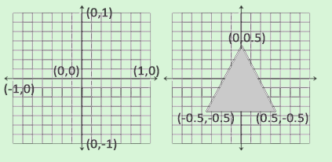
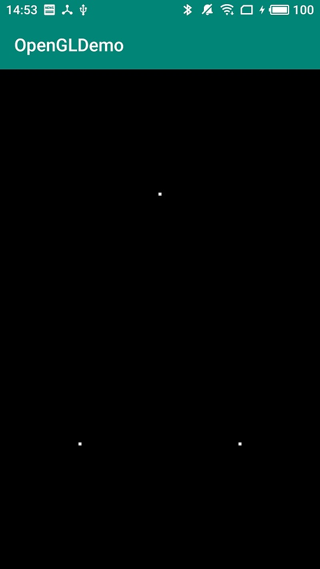
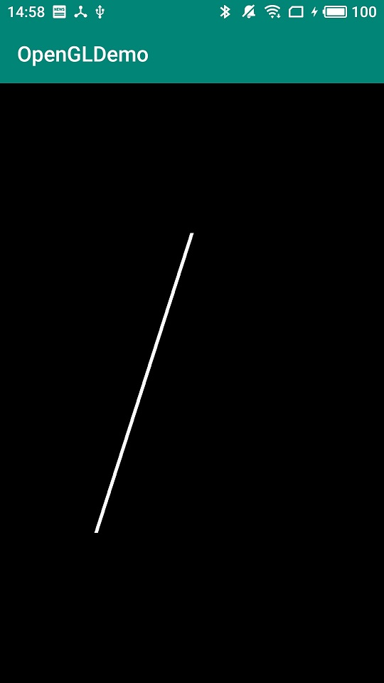
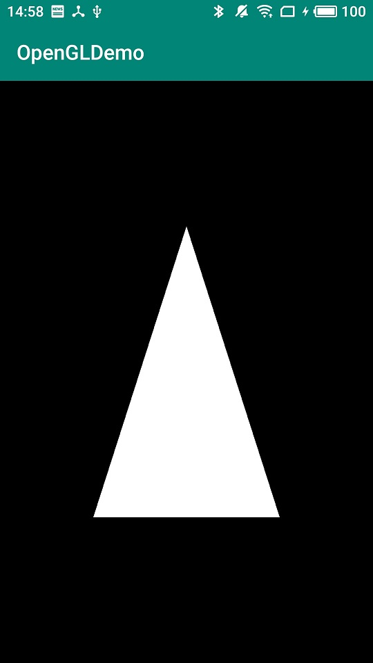

开始正式学习OpenGL ES开发！

本博客是我在学习过程中做的记录，也希望和各位分享我的学习过程，如有错误，欢迎留言指正，共同学习。

### 定义输入坐标

开始绘制图形之前，我们必须先给OpenGL输入一些顶点数据。OpenGL是一个3D图形库，所以我们在OpenGL中指定的所有坐标都是3D坐标（x、y和z）。OpenGL不是简单地把所有的3D坐标变换为屏幕上的2D像素；OpenGL仅当3D坐标在3个轴（x、y和z）上都为-1.0到1.0的范围内时才处理它。所有在所谓的标准化设备坐标(Normalized Device Coordinates)范围内的坐标才会最终呈现在屏幕上（在这个范围以外的坐标都不会显示）。

由于我们希望渲染一个三角形，我们一共要指定三个顶点，每个顶点都有一个3D位置。我们会将它们以标准化设备坐标的形式（OpenGL的可见区域）定义为一个`float`数组。

```c
private float[] vertexPoints = new float[]{
        0.0f, 0.5f, 0.0f,
        -0.5f, -0.5f, 0.0f,
        0.5f, -0.5f, 0.0f
};
```

由于OpenGL是在3D空间中工作的，而我们渲染的是一个2D三角形，我们将它顶点的z坐标设置为0.0。这样子的话三角形每一点的深度都是一样的，从而使它看上去像是2D的。

定义这样的顶点数据以后，我们会把它作为输入发送给图形渲染管线的第一个处理阶段：顶点着色器。它会在GPU上创建内存用于储存我们的顶点数据，还要配置OpenGL如何解释这些内存，并且指定其如何发送给显卡。顶点着色器接着会处理我们在内存中指定数量的顶点。

一旦你的顶点坐标已经在顶点着色器中处理过，它们就应该是**标准化设备坐标**了，标准化设备坐标是一个x、y和z值在-1.0到1.0的一小段空间。任何落在范围外的坐标都会被丢弃/裁剪，不会显示在你的屏幕上。下面你会看到我们定义的在标准化设备坐标中的三角形(忽略z轴)：




与通常的屏幕坐标不同，y轴正方向为向上，(0, 0)坐标是这个图像的中心，而不是左上角。最终你希望所有(变换过的)坐标都在这个坐标空间中，否则它们就不可见了。


### 分配本地内存

因为`OpenGL`作为本地系统库运行在系统中，虚拟机需要分配本地内存，供其存取。

```Java
public SimpleRenderer() {
    //分配内存空间,每个浮点型占4字节空间
    vertexBuffer = ByteBuffer.allocateDirect(vertexPoints.length * 4)
            .order(ByteOrder.nativeOrder())
            .asFloatBuffer();
    //传入指定的坐标数据
    vertexBuffer.put(vertexPoints);
    vertexBuffer.position(0);
}
```

### 顶点着色器

```java
/**
 * 顶点着色器
 */
private String vertextShader =
        "#version 300 es\n" +
        "layout (location = 0) in vec4 vPosition;\n" +
        "void main() {\n" +
        "     gl_Position  = vPosition;\n" + //
        "     gl_PointSize = 10.0;\n" +
        "}\n";
```

`输入属性的数组`(一个名为`vPosition`的4分量向量)，`layout (location = 0)`表示这个变量的位置是顶点属性0。

将`vPosition`输入属性拷贝到名为`gl_Position`的特殊输出变量。

将浮点数据`10.0`拷贝到`gl_PointSize`的变量中。

### 片段着色器

```java
/**
 * 片段着色器
 */
private String fragmentShader =
        "#version 300 es\n" +
        "precision mediump float;\n" +
        "out vec4 fragColor;\n" +
        "void main() {\n" +
        "     fragColor = vec4(1.0,1.0,1.0,1.0);\n" +
        "}\n";
```

声明着色器中浮点变量的默认精度。

着色器声明一个`输出变量fragColor`，这个是一个4分量的向量。

表示将颜色值`(1.0,1.0,1.0,1.0)`，输出到颜色缓冲区。

### 编译着色器

```java
/**
 * 编译
 *
 * @param type       顶点着色器:GLES30.GL_VERTEX_SHADER
 *                   片段着色器:GLES30.GL_FRAGMENT_SHADER
 */
private static int compileShader(int type, String shaderCode) {
    //创建一个着色器
    final int shaderId = GLES30.glCreateShader(type);
    if (shaderId != 0) {
        //加载到着色器
        GLES30.glShaderSource(shaderId, shaderCode);
        //编译着色器
        GLES30.glCompileShader(shaderId);
        //检测状态
        final int[] compileStatus = new int[1];
        GLES30.glGetShaderiv(shaderId, GLES30.GL_COMPILE_STATUS, compileStatus, 0);
        if (compileStatus[0] == 0) {
            String logInfo = GLES30.glGetShaderInfoLog(shaderId);
            System.err.println(logInfo);
            //创建失败
            GLES30.glDeleteShader(shaderId);
            return 0;
        }
        return shaderId;
    } else {
        //创建失败
        return 0;
    }
}
```

### 创建 OpenGL 程序和着色器链接

```java
/**
 * 链接
 *
 * @param vertexShaderId   顶点着色器
 * @param fragmentShaderId 片段着色器
 */
public static int linkProgram(int vertexShaderId, int fragmentShaderId) {
    final int programId = GLES30.glCreateProgram();
    if (programId != 0) {
        //将顶点着色器加入到程序
        GLES30.glAttachShader(programId, vertexShaderId);
        //将片元着色器加入到程序中
        GLES30.glAttachShader(programId, fragmentShaderId);
        //链接着色器程序
        GLES30.glLinkProgram(programId);
        final int[] linkStatus = new int[1];
        //验证OpenGL程序是否可用
        GLES30.glGetProgramiv(programId, GLES30.GL_LINK_STATUS, linkStatus, 0);
        if (linkStatus[0] == 0) {
            String logInfo = GLES30.glGetProgramInfoLog(programId);
            System.err.println(logInfo);
            GLES30.glDeleteProgram(programId);
            return 0;
        }
        return programId;
    } else {
        //创建失败
        return 0;
    }
}
```

### 绘制

准备工作结束，下来就开始绘制图形了。

```java
public class SimpleRenderer implements GLSurfaceView.Renderer
```

实现`GLSurfaceView.Renderer`接口

#### onSurfaceCreated

```java
@Override
public void onSurfaceCreated(GL10 gl10, EGLConfig eglConfig) {
    //设置背景颜色
    GLES30.glClearColor(0.5f, 0.5f, 0.5f, 0.5f);

    // 编译顶点着色器
    final int vertexShaderId = compileShader(GLES30.GL_VERTEX_SHADER, vertextShader);
    // 编译片段着色器
    final int fragmentShaderId = compileShader(GLES30.GL_FRAGMENT_SHADER, fragmentShader);
    //在OpenGLES环境中使用程序
    GLES30.glUseProgram(linkProgram(vertexShaderId, fragmentShaderId));
}
```

#### onSurfaceChanged

```java

@Override
public void onSurfaceChanged(GL10 gl10, int width, int height) {
     //设置视图窗口
    GLES30.glViewport(0, 0, width, height);
}
```

#### onDrawFrame

```java
@Override
    public void onDrawFrame(GL10 gl10) {
        //把颜色缓冲区设置为我们预设的颜色
        GLES30.glClear(GLES30.GL_COLOR_BUFFER_BIT);

        //准备坐标数据
        GLES30.glVertexAttribPointer(0, 3, GLES30.GL_FLOAT, false, 0, vertexBuffer);
        //启用顶点的句柄
        GLES30.glEnableVertexAttribArray(0);
        
        //绘制三个点
//        GLES30.glDrawArrays(GLES30.GL_POINTS, 0, 3);

        //绘制直线
//        GLES30.glDrawArrays(GLES30.GL_LINE_STRIP, 0, 2);
//        GLES30.glLineWidth(10);

        //绘制三角形
        GLES30.glDrawArrays(GLES30.GL_TRIANGLES, 0, 3);

        //禁止顶点数组的句柄
        GLES30.glDisableVertexAttribArray(0);
    }
```

##### 点 GLES30.GL_POINTS



##### 线 GLES30.GL_LINE_STRIP



##### 三角形 GLES30.GL_TRIANGLES



通过`glDrawArrays`方法来执行最后的绘制，`GL_POINTS`代表绘制的类型（图元类型），而参数`0，1`则代表绘制的点的范围，它是一个左闭右开的区间。

#### 常用图元类型

| 图元类型          | 描述                                   |
| :---------------- | :------------------------------------- |
| GL_POINTS         | 点精灵图元，对指定的每个顶点进行绘制。 |
| GL_LINES          | 绘制一系列不相连的线段。               |
| GL_LINE_STRIP     | 绘制一系列相连的线段。                 |
| GL_LINE_LOOP      | 绘制一系列相连的线段，首尾相连。       |
| GL_TRIANGLES      | 绘制一系列单独的三角形。               |
| GL_TRIANGLE_STRIP | 绘制一系列相互连接的三角形。           |
| GL_TRIANGLE_FAN   | 绘制一系列相互连接的三角形             |

### 完整代码

```java
public class SimpleRenderer implements GLSurfaceView.Renderer {
    private float[] vertexPoints = new float[]{
            0.0f, 0.5f, 0.0f,
            -0.5f, -0.5f, 0.0f,
            0.5f, -0.5f, 0.0f
    };
    private final FloatBuffer vertexBuffer;
    /**
     * 顶点着色器
     */
    private String vertextShader =
            "#version 300 es\n" +
                    "layout (location = 0) in vec4 vPosition;\n" +
                    "void main() {\n" +
                    "     gl_Position  = vPosition;\n" +
                    "     gl_PointSize = 10.0;\n" +
                    "}\n";

    /**
     * 片段着色器
     */
    private String fragmentShader =
            "#version 300 es\n" +
                    "precision mediump float;\n" +
                    "out vec4 fragColor;\n" +
                    "void main() {\n" +
                    "     fragColor = vec4(1.0,1.0,1.0,1.0);\n" +
                    "}\n";


    public SimpleRenderer() {
        //分配内存空间,每个浮点型占4字节空间
        vertexBuffer = ByteBuffer.allocateDirect(vertexPoints.length * 4)
                .order(ByteOrder.nativeOrder())
                .asFloatBuffer();
        //传入指定的坐标数据
        vertexBuffer.put(vertexPoints);
        vertexBuffer.position(0);
    }


    @Override
    public void onSurfaceCreated(GL10 gl10, EGLConfig eglConfig) {
        GLES30.glClearColor(0f, 0f, 0f, 0f);

        final int vertexShaderId = compileShader(GLES30.GL_VERTEX_SHADER, vertextShader);
        final int fragmentShaderId = compileShader(GLES30.GL_FRAGMENT_SHADER, fragmentShader);
        GLES30.glUseProgram(linkProgram(vertexShaderId, fragmentShaderId));
    }

    @Override
    public void onSurfaceChanged(GL10 gl10, int width, int height) {
        GLES30.glViewport(0, 0, width, height);
    }

    @Override
    public void onDrawFrame(GL10 gl10) {
        GLES30.glClear(GLES30.GL_COLOR_BUFFER_BIT);
        //准备坐标数据
        GLES30.glVertexAttribPointer(0, 3, GLES30.GL_FLOAT, false, 0, vertexBuffer);
        //启用顶点的句柄
        GLES30.glEnableVertexAttribArray(0);
        //绘制三个点
        GLES30.glDrawArrays(GLES30.GL_LINE_LOOP, 0, 3);

        //绘制直线
//        GLES30.glDrawArrays(GLES30.GL_LINE_STRIP, 0, 2);
//        GLES30.glLineWidth(10);

        //绘制三角形
//        GLES30.glDrawArrays(GLES30.GL_TRIANGLES, 0, 3);
        //禁止顶点数组的句柄
        GLES30.glDisableVertexAttribArray(0);
    }


    /**
     * 编译
     */
    private static int compileShader(int type, String shaderCode) {
        //创建一个着色器
        final int shaderId = GLES30.glCreateShader(type);
        if (shaderId != 0) {
            //加载到着色器
            GLES30.glShaderSource(shaderId, shaderCode);
            //编译着色器
            GLES30.glCompileShader(shaderId);
            //检测状态
            final int[] compileStatus = new int[1];
            GLES30.glGetShaderiv(shaderId, GLES30.GL_COMPILE_STATUS, compileStatus, 0);
            if (compileStatus[0] == 0) {
                String logInfo = GLES30.glGetShaderInfoLog(shaderId);
                System.err.println(logInfo);
                //创建失败
                GLES30.glDeleteShader(shaderId);
                return 0;
            }
            return shaderId;
        } else {
            //创建失败
            return 0;
        }
    }

    /**
     * 链接
     */
    public static int linkProgram(int vertexShaderId, int fragmentShaderId) {
        final int programId = GLES30.glCreateProgram();
        if (programId != 0) {
            //将顶点着色器加入到程序
            GLES30.glAttachShader(programId, vertexShaderId);
            //将片元着色器加入到程序中
            GLES30.glAttachShader(programId, fragmentShaderId);
            //链接着色器程序
            GLES30.glLinkProgram(programId);
            final int[] linkStatus = new int[1];
            GLES30.glGetProgramiv(programId, GLES30.GL_LINK_STATUS, linkStatus, 0);
            if (linkStatus[0] == 0) {
                String logInfo = GLES30.glGetProgramInfoLog(programId);
                System.err.println(logInfo);
                GLES30.glDeleteProgram(programId);
                return 0;
            }
            return programId;
        } else {
            //创建失败
            return 0;
        }
    }

}

public class MainActivity extends AppCompatActivity {
    private GLSurfaceView mGLSurfaceView;

    @Override
    protected void onCreate(Bundle savedInstanceState) {
        super.onCreate(savedInstanceState);
        setupViews();
    }

    private void setupViews() {
        mGLSurfaceView = new GLSurfaceView(this);
        setContentView(mGLSurfaceView);
        mGLSurfaceView.setEGLContextClientVersion(3);
        GLSurfaceView.Renderer renderer = new SimpleRenderer();
        mGLSurfaceView.setRenderer(renderer);
    }
}

```

参考：
《OpenGL ES 3.0 编程指南第2版》
《OpenGL ES应用开发实践指南Android卷》