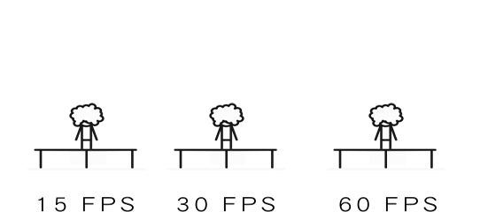
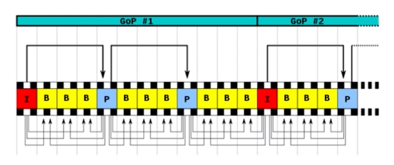

Android开发工作两年，真的是感觉Android应用层开发没什么前景了，于是打算在网络安全，智能硬件，音视频这几个方向发展，考虑了一段时间，最终决定选择音视频。理由就不说了，既然选择了就要好好学习了，今天就开始音视频的第一篇博客，从一些音视频的基础知识开始。

#### 硬解和软解

视频解码分为硬解和软解，所谓“软解”就是通过软件让 CPU 进行视频解码处理；而“硬解”是指不依赖于 CPU，通过专用的设备（子卡）单独完成视频解码，比如曾经的 VCD/DVD 解压卡、视频压缩卡都被冠以“硬解”的称号。现在实现高清硬解不需要额外的子卡，也不需要额外的投入，因为硬解码模块被整合在了 GPU 内部，而目前主流的显卡（包括整合显卡）都能支持硬解码。

 “硬解”其实更需要软件的支持，只是基本不需要 CPU 参与运算，从而为系统节约了很多资源开销。

#### RGB 和 YUV

RGB 指的是红绿蓝，应用还是很广泛的，比如显示器显示， bmp 文件格式中的像素值等；而 yuv 主要指亮度和两个色差信号，被称为 luminance 和 chrominance 他们的转化关系可以自己去查一下，我们视频里面基本上都是用yuv格式。

YUV文件格式又分很多种，如果算上存储格式，就更多了，比如 yuv444、 yuv422、 yuv411、 yuv420 等等，视频压缩用到的是 420 格式，这是 因为人眼对亮度更敏感些，对色度相对要差些。

#### 帧 Frame

简单的理解帧就是为视频或者动画中的每一张画面，而视频和动画特效就是由无数张画面组合而成，每一张画面都是一帧。

#### 帧数 Frames

帧数其实就是为帧生成数量的简称，可以解释为静止画面的数量

#### 帧率 Frame Rate
帧率(Frame rate) = 帧数(Frames)/时间(Time)，单位为帧每秒(f/s, frames per second, fps)

帧率是用于测量显示帧数的量度，测量单位为“每秒显示帧数”（ Frame per Second， FPS）或“赫兹”（ Hz），一般来说 FPS 用于描述视频、电子绘图或游戏每秒播放多少幀。

#### FPS（ Frame per Second）每秒显示帧数
FPS 是图像领域中的定义，是指画面每秒传输帧数，通俗来讲就是指动画或视频的画面数。 FPS 是测量用于保存、显示动态视频的信息数量。每秒钟帧数愈多，所显示的动作就会愈流畅。

#### 分辨率

指视频成像产品所形成的图像大小或尺寸

#### 刷新率

屏幕每秒画面被刷新的次数，分为垂直刷新率和水平刷新率，一般我们提到的都是指垂直刷新率，以赫兹(Hz)为单位，刷新率越高，图像就越稳定，图像显示就越自然清晰。

#### 编码格式

编码的目的是压缩数据量，采用编码算法压缩冗余数据。常用的编码格式有:

* MPEG(MPEG-2  MPEG-4)
* H.26X(H.263  H.264/AVC H.265/HEVC)
#### 码率

也就是比特率，比特率是单位时间播放连续的媒体(如压缩的音频和视频)的比特数量。比特率越高，带宽消耗得越多。

#### 视频帧

常见的视频帧有I、P、B帧。

* I帧关键帧，采用帧内压缩技术
* P帧向前参考帧，表示这一帧与上一帧的差别，属于帧间压缩技术
* B帧表示双向参考帧，压缩时既参考前一帧也参考后一帧，帧间压缩技术

一个 I 帧可以不依赖其他帧就解码出一幅完整的图像，而 P 帧、B 帧不行。P 帧需要依赖视频流中排在它前面的帧才能解码出图像。B 帧则需要依赖视频流中排在它前面或后面的帧才能解码出图像。

#### GOP

GOP即Group of picture（图像组），指两个I帧之间的距离，Reference（参考周期）指两个P帧之间的距离。一个I帧所占用的字节数大于一个P帧，一个P帧所占用的字节数大于一个B帧。所以在码率不变的前提下，GOP值越大，P、B帧的数量会越多，平均每个I、P、B帧所占用的字节数就越多，也就更容易获取较好的图像质量；Reference越大，B帧的数量越多，同理也更容易获得较好的图像质量。

#### DTS和PTS

* DTS: Decode Time Stamp,主要用于标示读入内存的比特流在什么时候开始送入解码器中进行解码。
* PTS: Presentation Time Stamp,主要用于度量解码后的视频帧什么时候被显示出来。

由于B帧需要前后的帧才能解出图像，所以可能一个视频中帧的显示顺序是I B B P，但我们在解码B帧时需要P帧的信息，所以在传输的视频流中的顺序是I P B B。这时候就体现出每帧都有 DTS 和 PTS 的作用了。DTS 告诉我们该按什么顺序解码这几帧图像，PTS 告诉我们该按什么顺序显示这几帧图像。

PTS:    1 4 2 3

DTS:    1 2 3 4

Stream: I P B B